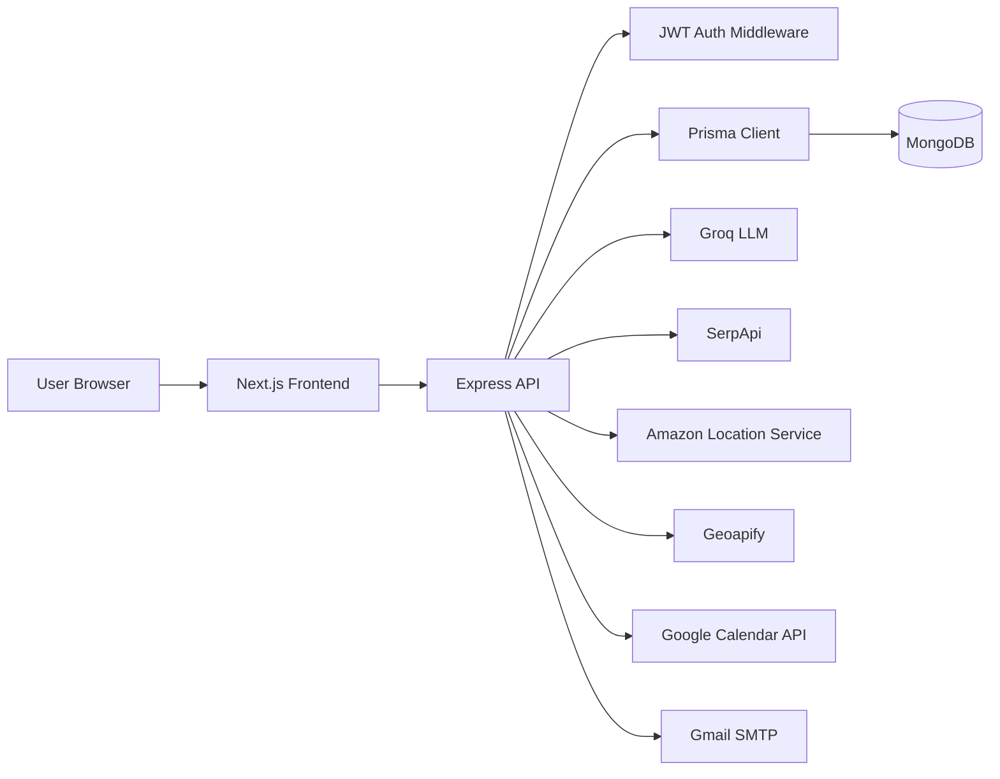

# SmartTravello

AI-powered full-stack travel planning platform for personalized trips, budgets, routes, itineraries, local events, transport options, accommodation discovery, travel news, calendar sync, and recommendation emails.


## Project Description

SmartTravello lets a user describe a trip in natural language and turns that prompt into a stored, explorable travel plan. The backend parses the prompt with Groq, falls back to a deterministic parser when AI parsing is unavailable, geocodes the route with Geoapify, saves the trip in MongoDB through Prisma, and then runs a sequential multi-agent planning pipeline.

The frontend is a Next.js dashboard with authentication, trip creation, trip comparison, rich trip detail pages, charts, route maps, PDF itinerary download, Google Calendar sync, dark/light theme support, and an authenticated AI travel chatbot.

## Features

### Trip Planning

- Natural-language trip creation from prompts such as "Plan a 5-day trip to Mumbai from Delhi starting October 15th for 2 adults with a budget of $2000".
- Groq-powered prompt parsing into structured trip fields: title, origin, destination, dates, travelers, budget, and status.
- Fallback prompt parsing and future-date normalization so common prompts can still create trips when Groq parsing fails or returns a past year.
- Geoapify geocoding for origin and destination coordinates.
- Multi-agent orchestration that attempts every planning agent in a fixed sequence and logs each run in `AgentTask`.
- Orchestrator responses report `COMPLETE_SUCCESS`, `PARTIAL_SUCCESS`, or `FAILED`; stored trips are updated to `COMPLETED` or `FAILED`.

### Specialized Travel Agents

- Weather agent: fetches Google weather results through SerpApi and stores daily forecasts.
- Flight agent: searches Google Flights through SerpApi, including mapped city-to-airport code conversion for supported cities.
- Train agent: generates train options with Groq and falls back to simulated options when generation fails.
- Hotels agent: searches Google Hotels through SerpApi and stores hotel summaries, prices, ratings, amenities, thumbnails, and booking links.
- News agent: fetches recent destination travel and tourism news through SerpApi Google News.
- Budget agent: calculates a category-level trip budget using available flight and hotel data, with estimated fallback costs.
- Events agent: fetches destination events through SerpApi Google Events and stores them in the database.
- Itinerary agent: generates daily points of interest with Groq, combines them with weather and budget context, stores daily itinerary items, and stores a full itinerary plan.
- Maps agent: uses Amazon Location Service Routes to calculate origin-to-destination route distance, duration, estimated cost, turn-by-turn steps, and route geometry.

### Frontend Experience

- Video-backed landing page with featured destination cards and GSAP-loaded animations.
- Signup and login screens with travel imagery, validation states, theme toggle, and local JWT storage.
- Authenticated dashboard with user greeting, recent trips, quick stats, logout, and navigation cards.
- New trip screen with prompt examples and visible agent progress states.
- My Trips page with trip cards, travel dates, trip counts, and status labels.
- Trip comparison screen for up to 4 trips, comparing weather, budget, duration, travelers, and events.
- Trip overview screen with navigation cards for each generated planning module.
- Weather screen with forecast overview, rainy-day count, Recharts visualizations, and daily forecast data.
- Flight screen with best/other flight tabs, sorting by price, duration, or stops, segment details, and booking links.
- Train screen with sorting by price, departure, or duration, stop details, class/type details, and booking links when present.
- Hotels screen with sorting by low price, high price, or rating, hotel details, amenities, thumbnails, and booking links.
- Budget screen with budget summary, category breakdown, budget items, totals, and a Recharts pie chart.
- Itinerary screen with expandable daily itinerary sections, weather hints, costs, PDF download, and Google Calendar sync controls.
- Routes screen with route cards, turn-by-turn steps, distance/duration/cost, and a Leaflet map modal using OpenStreetMap tiles. If a completed trip has no stored route, the backend calculates one on demand with AWS Location.
- Events screen with category filters, recommended-only toggle, event cards, venue/location/date details, booking links, and a clean empty state when SerpApi returns no events.
- News screen with destination news cards, thumbnails, source/date metadata, and article links.
- Floating SmartTravello AI chatbot connected to the protected backend `/api/chat` route.
- Dark/light theme context with persistence in `localStorage`.

### Notifications, Calendar, and Documents

- PDF itinerary generation with `pdfkit`.
- Itinerary email generation through Gmail SMTP via `nodemailer`.
- Scheduled recommendation emails using `node-cron`.
- Google OAuth through NextAuth for Calendar permissions.
- Backend Google Calendar sync endpoint that inserts itinerary activities into the user's primary calendar.

## Screenshots

Screenshots are not committed yet. Add images to `docs/screenshots/` and update the paths below.

| Landing Page | Dashboard | Trip Overview |
| --- | --- | --- |
|  |  |  |

| Itinerary | Routes | Budget |
| --- | --- | --- |
|  |  |  |

## Tech Stack

| Layer | Technologies |
| --- | --- |
| Frontend | Next.js 15 App Router, React 19, TypeScript, Tailwind CSS, lucide-react |
| Frontend data/UI | Fetch API, Axios helper, Recharts, Leaflet, OpenStreetMap tiles, NextAuth |
| Backend | Node.js, Express 5, ES modules, Zod, CORS, Nodemon |
| Database | MongoDB, Prisma Client, Prisma schema with MongoDB ObjectId models |
| Authentication | bcrypt password hashing, JSON Web Tokens, protected Express middleware, NextAuth Google provider for Calendar OAuth |
| AI | Groq through the OpenAI-compatible SDK client |
| External APIs | SerpApi, Amazon Location Service Routes API, Geoapify Geocoding API, Google Calendar API |
| Email and jobs | Nodemailer with Gmail SMTP, node-cron scheduled jobs |
| Documents | PDFKit for itinerary PDFs |
| Local infrastructure | Docker Compose for MongoDB |

## Architecture Overview



The backend is organized as a route/controller/service/agent architecture:

- `app.js` mounts Express middleware and API routers.
- `index.js` loads environment variables, starts the HTTP server, initializes cron jobs, and handles graceful shutdown.
- Route files in `backend/src/routes` define HTTP endpoints.
- Controller files in `backend/src/controllers` validate request context and call services or agents.
- Agent files in `backend/src/agents` encapsulate travel planning tools.
- Service files in `backend/src/services` handle email, scheduled jobs, and recommendation generation.
- Prisma models in `backend/prisma/schema.prisma` define the MongoDB data model.

The agent orchestration is explicit and sequential. After a trip is created, the orchestrator attempts:

1. Weather
2. Flights
3. Trains
4. Hotels
5. News
6. Budget
7. Events
8. Itinerary
9. Maps

Each agent run is logged to `AgentTask`, and the final response includes successful tools, failed tools, database-backed trip data, and AI-generated trip insights.

## Installation & Setup

### Prerequisites

- Node.js and npm. This workspace was inspected with Node `v20.20.2` and npm `10.8.2`.
- MongoDB, preferably MongoDB Atlas or a local replica set. Prisma MongoDB writes can require transactions, and standalone local MongoDB may fail with `P2031`.
- API keys for the integrations you plan to use.

### 1. Clone and install dependencies

```bash
git clone <your-repository-url>
cd SmartTravello

cd backend
npm install

cd ../frontend
npm install
```

### 2. Start or configure MongoDB

The included Compose file starts MongoDB only:

```bash
cd SmartTravello
docker compose -f docker/docker-compose.yml up -d
```

MongoDB will be available at:

```text
mongodb://localhost:27017/smarttravello
```

For the smoothest local run, use a MongoDB Atlas connection string or configure local MongoDB as a replica set. If you use Atlas, make sure the database name is present in the URL path, for example:

```text
mongodb+srv://<user>:<password>@<cluster>/smarttravello?appName=Cluster0
```

### 3. Configure environment variables

```bash
cd SmartTravello
cp backend/.env.example backend/.env
cp frontend/.env.example frontend/.env.local
```

Fill in real values in the copied files. Do not commit real secrets.

### 4. Generate Prisma Client and push the schema

```bash
cd backend
npx prisma generate
npx prisma db push
```

Optional database browser:

```bash
npx prisma studio
```

### 5. Run the backend

```bash
cd backend
npm run dev
```

Backend API:

```text
http://localhost:5000/api
```

### 6. Run the frontend

```bash
cd frontend
npm run dev
```

Frontend app:

```text
http://localhost:3000
```

## Environment Variables

### Backend: `backend/.env`

| Variable | Required | Purpose |
| --- | --- | --- |
| `PORT` | Yes | Express server port. Defaults to `5000` in code. |
| `DATABASE_URL` | Yes | MongoDB connection string used by Prisma. |
| `GROQ_API_KEY` | Yes | Groq API key used by prompt parsing, chat, train generation, itinerary POIs, and recommendations. |
| `GROQ_MODEL` | No | Groq model name. Defaults to `llama-3.3-70b-versatile`. |
| `SERPAPI_KEY` | Yes for data agents | Used by weather, flights, hotels, news, and events agents. |
| `AWS_LOCATION_API_KEY` or `VITE_AWS_LOCATION_API_KEY` | Yes for routes | Amazon Location Service public API key used by the maps agent for route directions. API keys usually start with `v1.public.`; AWS access key IDs such as `AKIA...` are not valid here. |
| `AWS_LOCATION_REGION` or `VITE_AWS_REGION` | Yes for routes | AWS region for Amazon Location Service. Defaults to `us-east-1` in code. |
| `GEOAPIFY_API_KEY` | Yes for geocoding | Used during trip creation to geocode origin and destination. |
| `GOOGLE_CLIENT_ID` | Yes for Calendar | Google OAuth client ID for Calendar auth/sync. |
| `GOOGLE_CLIENT_SECRET` | Yes for Calendar | Google OAuth client secret for Calendar auth/sync. |
| `GOOGLE_REDIRECT_URI` | Yes for Calendar | OAuth callback URL. Example: `http://localhost:3000/auth/google/callback`. |
| `EMAIL_USER` | Yes for email | Gmail address used by Nodemailer. |
| `EMAIL_PASS` | Yes for email | Gmail app password used by Nodemailer. |
| `JWT_SECRET` | Yes | Secret used to sign and verify app JWTs. |
| `JWT_EXPIRES_IN` | No | JWT lifetime. Defaults to `1d` in code. |

### Frontend: `frontend/.env.local`

| Variable | Required | Purpose |
| --- | --- | --- |
| `NEXT_PUBLIC_API_URL` | Yes | Browser-visible API base URL. Used by `Chatbot.jsx`; many pages currently still hardcode localhost. |
| `GOOGLE_CLIENT_ID` | Yes for Calendar | Google OAuth client ID used by NextAuth. |
| `GOOGLE_CLIENT_SECRET` | Yes for Calendar | Google OAuth client secret used by NextAuth. |
| `NEXTAUTH_SECRET` | Yes for NextAuth | Secret for NextAuth session signing. |

## Usage Guide

1. Register a user at `/signup`.
2. Log in at `/login`. The frontend stores the returned JWT in `localStorage`.
3. Open `/dashboard` and select `Plan New Trip`.
4. Enter a natural-language trip prompt and submit.
5. The backend creates the trip and runs the planning agents.
6. After completion, open the trip overview and inspect each module:
   - Weather
   - Flights
   - Trains
   - Hotels
   - News
   - Budget
   - Itinerary
   - Routes
   - Events
7. Use the itinerary page to download a PDF travel roadmap.
8. Sign in with Google from the itinerary page to sync itinerary items to Google Calendar.
9. Use the floating SmartTravello AI chatbot on the dashboard for travel questions.
10. Use the Compare Trips page to compare up to 4 stored trips.

Example trip prompt:

```text
Plan a 5-day trip to Mumbai from Delhi starting October 15th for 2 adults with a budget of $2000
```

## API Endpoints

Base URL:

```text
http://localhost:5000/api
```

### Authentication

| Method | Endpoint | Auth | Description |
| --- | --- | --- | --- |
| `POST` | `/auth/register` | No | Register with `name`, `email`, and `password`. |
| `POST` | `/auth/login` | No | Log in and receive a JWT plus user details. |
| `GET` | `/auth/me` | Bearer JWT | Return the current authenticated user. |

### AI and Trip Planning

| Method | Endpoint | Auth | Description |
| --- | --- | --- | --- |
| `POST` | `/agents/run` | Bearer JWT | Create a trip from a prompt and run all planning agents. |
| `POST` | `/chat` | Bearer JWT | Send a chatbot message with optional recent history. |

Example:

```bash
curl -X POST http://localhost:5000/api/agents/run \
  -H "Content-Type: application/json" \
  -H "Authorization: Bearer <jwt>" \
  -d '{"prompt":"Plan a 3-day trip to Jaipur from Delhi for 2 adults with a budget of $1500"}'
```

### Trips

| Method | Endpoint | Auth | Description |
| --- | --- | --- | --- |
| `POST` | `/trips/trips/start` | Bearer JWT | Acknowledge a trip planning request. The implemented creation path is `/agents/run`. |
| `GET` | `/trips` | Bearer JWT | List all trips for the authenticated user. |
| `GET` | `/trips/:id/summary` | Bearer JWT | Return a comprehensive trip summary with related data counts and rollups. |
| `DELETE` | `/trips/:id` | Bearer JWT | Delete a trip owned by the authenticated user. |
| `GET` | `/trips/:id/weather` | Bearer JWT | Return stored weather forecast data. |
| `GET` | `/trips/:id/flights` | Bearer JWT | Return stored flight search results. |
| `GET` | `/trips/:id/hotels` | Bearer JWT | Return stored hotel results and price statistics. |
| `GET` | `/trips/:id/trains` | Bearer JWT | Return stored train options. |
| `GET` | `/trips/:id/news` | Bearer JWT | Return stored destination news. |
| `GET` | `/trips/:id/budget` | Bearer JWT | Return budget summary and category breakdown. |
| `GET` | `/trips/:id/budget/items` | Bearer JWT | Return raw budget items and totals. |
| `GET` | `/trips/:id/events` | Bearer JWT | Return stored local events. Returns `200` with an empty `events` array when none are found. |
| `GET` | `/trips/:id/itinerary` | Bearer JWT | Return the stored full itinerary plan. |
| `GET` | `/trips/:id/itinerary/items` | Bearer JWT | Return detailed itinerary items grouped by day. |
| `GET` | `/trips/:id/itinerary/full` | Bearer JWT | Return both full itinerary and detailed items. |
| `GET` | `/trips/:id/routes` | Bearer JWT | Return stored route records. If no route exists, the backend attempts to calculate and store one on demand through AWS Location. |
| `GET` | `/trips/:id/maps` | Bearer JWT | Return origin/destination coordinates and route data. |
| `GET` | `/trips/:id/orchestrator` | Bearer JWT | Return legacy orchestrator summary data if present. |

### Itinerary Documents

| Method | Endpoint | Auth | Description |
| --- | --- | --- | --- |
| `GET` | `/itinerary/download-pdf/:tripId` | Not enforced in route | Generate and download an itinerary PDF for a trip. |

### Google Calendar

| Method | Endpoint | Auth | Description |
| --- | --- | --- | --- |
| `POST` | `/calendar/sync` | Bearer JWT plus Google token headers | Insert itinerary events into the user's primary Google Calendar. |
| `GET` | `/calendar/auth-url` | No | Generate a Google OAuth URL. |
| `GET` | `/calendar/callback` | No | Exchange a Google authorization code for tokens. |

Calendar sync expects these request headers:

```text
Authorization: Bearer <jwt>
X-Google-Access-Token: <google-access-token>
X-Google-Refresh-Token: <google-refresh-token>
```

The itinerary page currently uses the Express backend endpoint at `http://localhost:5000/api/calendar/sync`. A similar Next.js API route exists under `frontend/src/app/api/calender/sync/route.ts`, but the itinerary page does not currently post to it.

### Cron and Recommendation Testing

| Method | Endpoint | Auth | Description |
| --- | --- | --- | --- |
| `POST` | `/cron/trigger-recommendations` | No | Manually trigger scheduled recommendation emails. |
| `POST` | `/cron/test-recommendation` | No | Generate a test recommendation email payload. |
| `GET` | `/cron/status` | No | Return registered cron job names. |

### Present but Not Mounted

`backend/src/routes/emailRoutes.js` defines:

```text
POST /trips/:tripId/send-itinerary
```

That router is not currently mounted in `backend/app.js`, so it is not part of the active API surface.

## Folder Structure

```text
SmartTravello/
|-- README.md
|-- package-lock.json
|-- backend/
|   |-- app.js                         # Express app, middleware, and mounted API routes
|   |-- index.js                       # Server startup, cron initialization, graceful shutdown
|   |-- package.json                   # Backend scripts and dependencies
|   |-- .env.example                   # Backend environment template
|   |-- kgmidCache.json                # Cached data file present in the backend folder
|   |-- prisma/
|   |   |-- schema.prisma              # Active Prisma MongoDB schema
|   |   |-- s.json                     # Empty JSON file currently present
|   |-- src/
|       |-- agents/                    # Weather, flights, trains, hotels, news, budget, events, itinerary, maps, orchestrator
|       |-- config/                    # Prisma client and Groq client setup
|       |-- controllers/               # Express controller logic
|       |-- middleware/                # JWT authentication middleware
|       |-- routes/                    # API route definitions
|       |-- services/                  # Email, cron, and recommendation services
|       |-- utils/                     # Trip itinerary email utility
|-- frontend/
|   |-- package.json                   # Frontend scripts and dependencies
|   |-- .env.example                   # Frontend environment template
|   |-- next.config.ts                 # Next.js config
|   |-- tailwind.config.js             # Tailwind config
|   |-- public/
|   |   |-- videos/                    # Landing page video asset
|   |   |-- hotel-images/              # Static hotel image assets
|   |-- src/
|       |-- app/
|       |   |-- page.tsx                # Landing page
|       |   |-- layout.tsx              # Root layout and theme bootstrap script
|       |   |-- Provider.tsx            # Session and theme providers
|       |   |-- context/                # Theme context
|       |   |-- api/                    # NextAuth and frontend calendar API route
|       |   |-- login/                  # Login page
|       |   |-- signup/                 # Signup page
|       |   |-- dashboard/              # Dashboard, trip creation, comparison, trip detail pages
|       |   |-- planner/                # Empty page file currently present
|       |   |-- profile/                # Empty page file currently present
|       |-- components/
|       |   |-- Chatbot.jsx             # Floating authenticated AI chat widget
|       |   |-- layouts/Header.tsx      # Header component, not currently imported by pages found
|       |-- lib/api.ts                 # Axios auth helper for auth calls
|-- database/
|   |-- schema.prisma                  # Copy of the Prisma schema
|-- docker/
    |-- docker-compose.yml             # MongoDB service
    |-- Dockerfile.backend             # Empty placeholder
    |-- Dockerfile.frontend            # Empty placeholder
```

## Database Design

The active Prisma schema is `backend/prisma/schema.prisma`. It uses MongoDB with `@db.ObjectId` IDs.

| Model | Purpose |
| --- | --- |
| `User` | Stores account details, password hash, theme preference, optional avatar, Google token field, trips, notifications, and trip comparisons. |
| `Trip` | Core trip record with user ownership, origin/destination, coordinates, dates, traveler count, status, total budget, summaries, and JSON snapshots for flights, hotels, trains, and news. |
| `Itinerary` | One-to-one full itinerary plan for a trip, including tool name, summary, and full JSON plan. |
| `ItineraryItem` | Day-level itinerary records with title, description, times, location, category, cost, and ordering. |
| `WeatherData` | Daily weather forecast records linked to a trip. |
| `Route` | Route distance, duration, cost, route metadata, and full Amazon Location route response data. |
| `Event` | Destination event records with venue, dates, category, price, booking URL, recommendation metadata, and raw API JSON. |
| `BudgetItem` | Budget category records with estimated amount, actual amount, status, and notes. |
| `AgentTask` | Execution log for each planning agent, including input data, result data, status, timestamps, and errors. |
| `Notification` | User notifications optionally linked to trips. |
| `TripComparison` | Schema model for persisted trip comparisons, though the current comparison UI computes comparisons client-side from trip summaries. |

Key design choices:

- Trip ownership is enforced in protected trip controller queries through `user_id`.
- Frequently accessed module data is split between normalized collections and JSON fields on `Trip`.
- Agent execution logs are persisted separately from trip data for observability.
- The root `database/schema.prisma` currently mirrors `backend/prisma/schema.prisma`; Prisma commands run from `backend` use the backend schema.

## Authentication Flow

### App Login

1. A user registers through `POST /api/auth/register`.
2. The backend hashes the password with `bcrypt`.
3. Login through `POST /api/auth/login` verifies the password and signs a JWT with `JWT_SECRET`.
4. The frontend stores the JWT in `localStorage` as `token`.
5. Protected frontend requests send:

```text
Authorization: Bearer <jwt>
```

6. The backend `authenticate` middleware verifies the token and adds decoded user data to `req.user`.
7. Trip queries use `req.user.userId` to scope data to the authenticated user.

### Google Calendar

Google auth is separate from the app JWT flow:

1. NextAuth uses Google OAuth with Calendar scope.
2. NextAuth stores access and refresh token data in the session callback.
3. The itinerary page reads the Google tokens from the session.
4. Calendar sync sends the app JWT and Google tokens to the backend.
5. The backend inserts itinerary events into the primary Google Calendar.

## Deployment Instructions

### Backend

1. Provision MongoDB, for example with MongoDB Atlas.
2. Configure all required backend environment variables on the hosting platform.
3. Install dependencies and generate Prisma Client:

```bash
cd backend
npm install
npx prisma generate
npx prisma db push
```

4. Start the API:

```bash
npm run dev
```

The current `start` script also uses `nodemon index.js`, which is development-oriented. For production, add a production start script that runs `node index.js`.

### Frontend

1. Configure `NEXT_PUBLIC_API_URL`, `GOOGLE_CLIENT_ID`, `GOOGLE_CLIENT_SECRET`, and `NEXTAUTH_SECRET`.
2. Build the frontend:

```bash
cd frontend
npm install
npm run build
npm run start
```

### Deployment Notes

- `backend/app.js` and `backend/index.js` currently use `http://localhost:3000` in CORS configuration. Update this to the deployed frontend origin before production deployment.
- Many frontend pages call `http://localhost:5000/api` directly. Replace those with `NEXT_PUBLIC_API_URL` before deploying.
- `docker/docker-compose.yml` only runs MongoDB. The backend and frontend Dockerfiles are empty placeholders.
- Configure Google OAuth redirect URIs in Google Cloud Console for the deployed domain.
- Gmail email sending requires an app password, not a normal account password.

## Development Commands

Backend:

```bash
cd backend
npm run dev
npx prisma generate
npx prisma db push
```

Frontend:

```bash
cd frontend
npm run dev
npm run build
npm run lint
```

MongoDB:

```bash
docker compose -f docker/docker-compose.yml up -d
docker compose -f docker/docker-compose.yml down
```

## Contributing Guidelines

1. Fork the repository and create a feature branch.
2. Install backend and frontend dependencies.
3. Copy both `.env.example` files and configure local secrets.
4. Keep changes scoped to the feature or fix.
5. Run relevant checks before opening a pull request:

```bash
cd frontend
npm run lint
npm run build
```

6. For backend changes, manually verify the affected API routes because the current backend test script is a placeholder.
7. Document new environment variables, endpoints, and setup steps in this README.
8. Do not commit `.env`, `.env.local`, database dumps, generated build output, or real API keys.

## Future Enhancements

- Add real-time agent progress updates with Server-Sent Events, WebSockets, or a queue-backed worker.
- Persist trip comparison results through the existing `TripComparison` model.
- Add editable budget actuals and expense tracking.
- Add multi-currency support and currency conversion.
- Add shareable public itinerary links.
- Add itinerary regeneration controls per module instead of rerunning the entire pipeline.
- Add Redis/Bull-backed background jobs for long-running agent workflows.
- Add production-ready Dockerfiles for backend and frontend.
- Add automated tests for controllers, agents, auth middleware, and critical frontend pages.

## TODO / Known Gaps

- Add real screenshots under `docs/screenshots/`.
- Add a repository-level `LICENSE` file.
- Fill `docker/Dockerfile.backend` and `docker/Dockerfile.frontend`; both files are currently empty.
- Replace hardcoded frontend API URLs with `NEXT_PUBLIC_API_URL`.
- Replace hardcoded backend CORS origin with an environment-based allowlist.
- Mount `backend/src/routes/emailRoutes.js` in `backend/app.js` if manual itinerary email sending should be public API.
- Add or remove schema/controller references for fields that are used in code but missing from the Prisma schema, such as `last_calendar_sync` and `children`.
- Decide whether unsupported `mapsAgent` actions (`nearby`, `place_details`, `distance_matrix`) should be implemented with AWS Location or removed from the public agent schema. The active route flow uses `directions`.
- Add backend tests; `backend/package.json` currently has a placeholder test script.
- Align the trip comparison UI with the backend summary response; the UI references precipitation data that the current summary endpoint does not return.
- Normalize the frontend calendar route folder spelling from `calender` to `calendar` if the local route is kept.
- Decide whether `database/schema.prisma` should remain as a schema copy or be removed to avoid drift.

## License

TODO: Add a repository-level license file. The backend `package.json` currently declares `ISC`, while the repository root does not include a `LICENSE` file.
