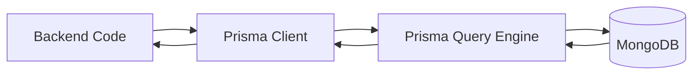
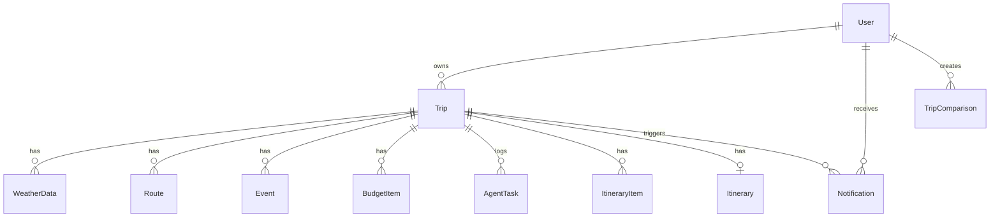
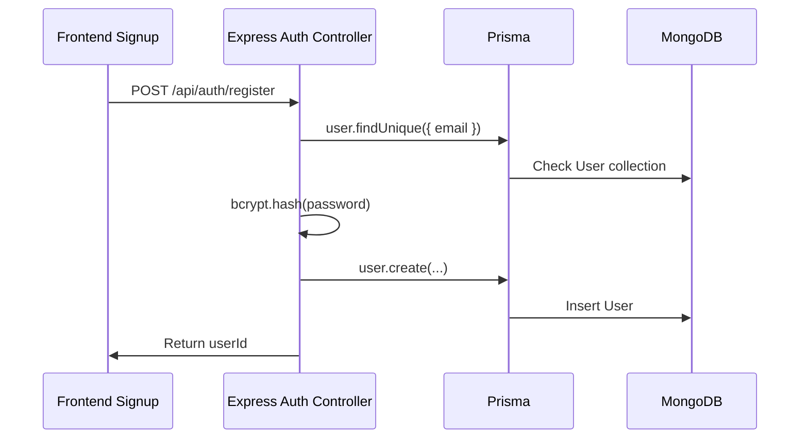

# Prisma Guide for SmartTravello

This document explains what Prisma is, how it works, and exactly how SmartTravello uses it with MongoDB.

## What Prisma Is

Prisma is a database toolkit for Node.js and TypeScript/JavaScript applications. It gives the application a schema-based way to talk to the database without writing raw database queries everywhere.

In simple terms:

```text
Prisma schema
  -> describes the database models
  -> generates Prisma Client
  -> application imports Prisma Client
  -> code calls prisma.user.findUnique(), prisma.trip.create(), etc.
  -> Prisma sends the actual database query to MongoDB
```

Prisma is not the database. In this project, MongoDB is the database. Prisma is the layer that defines models and gives the backend a clean API for database operations.

## Why Prisma Is Used In This Project

SmartTravello stores many related travel-planning entities:

- Users
- Trips
- Weather data
- Routes
- Events
- Budget items
- Itinerary records
- Agent task logs
- Notifications
- Trip comparisons

Without Prisma, the backend would need raw MongoDB queries across controllers, agents, services, and utilities. Prisma gives the project:

- A single schema file for the database shape.
- A generated database client.
- Consistent CRUD methods such as `findUnique`, `findMany`, `create`, `update`, and `deleteMany`.
- Model-level relations such as `User -> Trip` and `Trip -> WeatherData`.
- Better maintainability when many files access the same database.

## Prisma Files In SmartTravello

| File | Purpose |
| --- | --- |
| `backend/prisma/schema.prisma` | Active Prisma schema used by the backend. |
| `database/schema.prisma` | A copy of the schema kept at project level. |
| `backend/src/config/db.js` | Creates and exports one shared `PrismaClient` instance. |
| `backend/package.json` | Includes `prisma` and `@prisma/client`. |
| `backend/.env` | Contains `DATABASE_URL`. |
| `backend/.env.example` | Shows the expected database connection variable. |

The active database config is:

```prisma
generator client {
  provider = "prisma-client-js"
}

datasource db {
  provider = "mongodb"
  url      = env("DATABASE_URL")
}
```

This means:

- Prisma should generate a JavaScript client.
- The database provider is MongoDB.
- The connection string is read from `DATABASE_URL`.

## How Prisma Works Internally

### 1. You Define Models

Models are written in `backend/prisma/schema.prisma`.

Example:

```prisma
model User {
  id            String   @id @default(auto()) @map("_id") @db.ObjectId
  email         String   @unique
  password_hash String
  name          String
  created_at    DateTime @default(now())
  updated_at    DateTime @updatedAt
  trips         Trip[]
}
```

This tells Prisma that the database has a `User` collection with fields like `email`, `password_hash`, and `name`.

### 2. Prisma Generates A Client

When you run:

```bash
cd backend
npx prisma generate
```

Prisma reads the schema and generates a client inside `node_modules`. That client exposes model APIs:

```js
prisma.user.findUnique(...)
prisma.trip.create(...)
prisma.weatherData.findMany(...)
```

### 3. The Backend Imports Prisma Client

SmartTravello creates one shared Prisma client in:

```text
backend/src/config/db.js
```

```js
import "dotenv/config";
import { PrismaClient } from '@prisma/client';

const prisma = new PrismaClient();

export default prisma;
```

Every controller, agent, or service imports this shared `prisma` object instead of creating a new client each time.

### 4. Application Code Calls Prisma Methods

Example from authentication:

```js
const existingUser = await prisma.user.findUnique({
  where: { email }
});
```

Example from trip creation:

```js
const trip = await prisma.trip.create({
  data: {
    user_id: userId,
    title: tripData.title,
    origin: tripData.origin,
    destination: tripData.destination,
    start_date: new Date(tripData.start_date),
    end_date: new Date(tripData.end_date),
    adults: tripData.adults,
    status: tripData.status,
    total_budget: tripData.total_budget,
    summary: tripData
  }
});
```

### 5. Prisma Converts The Call Into A Database Operation

The backend code does not manually construct a MongoDB query. Prisma takes the method call and communicates with MongoDB through its query engine.



## MongoDB-Specific Prisma Concepts

SmartTravello uses Prisma with MongoDB, so a few schema details are important.

### ObjectId Fields

MongoDB uses `_id` ObjectIds as primary keys. Prisma models expose them as `id`.

```prisma
id String @id @default(auto()) @map("_id") @db.ObjectId
```

Meaning:

- `String`: application code sees the ID as a string.
- `@id`: this is the primary key.
- `@default(auto())`: MongoDB can auto-generate it.
- `@map("_id")`: map Prisma field `id` to MongoDB field `_id`.
- `@db.ObjectId`: store it as a MongoDB ObjectId.

Foreign keys also use `@db.ObjectId`:

```prisma
user_id String @db.ObjectId
trip_id String @db.ObjectId
```

### Relations In MongoDB

MongoDB does not enforce relational joins like SQL databases, but Prisma lets the schema describe relationships.

Example:

```prisma
model Trip {
  user_id String @db.ObjectId
  user    User   @relation(fields: [user_id], references: [id])
}
```

This means each `Trip` belongs to a `User`.

The reverse relation is:

```prisma
model User {
  trips Trip[]
}
```

Prisma uses these definitions to let the code include related data:

```js
const trip = await prisma.trip.findUnique({
  where: { id: tripId },
  include: { user: true }
});
```

### JSON Fields

The project uses `Json` for flexible external API and AI-generated data:

```prisma
summary              Json
orchestrator_summary Json?
origin_coords        Json
destination_coords   Json
flights_data         Json?
hotels_data          Json?
trains_data          Json?
news_data            Json?
```

This is useful because travel API responses can be deeply nested and may change shape over time.

Example:

- `Trip.flights_data` stores transformed SerpApi Google Flights results.
- `Trip.hotels_data` stores hotel summaries, prices, thumbnails, and booking links.
- `Route.route_data` stores steps and route geometry.
- `Event.raw_json` stores the original event result for debugging.
- `Itinerary.full_plan` stores the full generated itinerary.

## SmartTravello Data Model Overview



## Main Models In This Project

### User

Stores registered users.

Important fields:

- `email`
- `password_hash`
- `name`
- `theme_preference`
- `google_token`

Used in:

- Registration
- Login
- Current user lookup
- Trip ownership

Example:

```js
const user = await prisma.user.findUnique({
  where: { email }
});
```

### Trip

The central model of the application. A trip stores user input, parsed travel details, coordinates, status, budget, and JSON results from several agents.

Important fields:

- `user_id`
- `title`
- `origin`
- `destination`
- `origin_coords`
- `destination_coords`
- `start_date`
- `end_date`
- `adults`
- `status`
- `total_budget`
- `summary`
- `flights_data`
- `hotels_data`
- `trains_data`
- `news_data`

Used in:

- Trip creation
- Dashboard listing
- Trip summary page
- Agent orchestration
- Calendar sync ownership verification

Example:

```js
const trips = await prisma.trip.findMany({
  where: { user_id: userId },
  orderBy: { created_at: 'desc' }
});
```

### WeatherData

Stores one weather forecast row per trip day.

Created by:

- `weatherAgent.js`

Read by:

- Weather page API
- Itinerary agent

Example:

```js
const weatherData = await prisma.weatherData.findMany({
  where: { trip_id: id },
  orderBy: { date: 'asc' }
});
```

### Route

Stores route details from Amazon Location Service.

Created by:

- `mapsAgent.js`

Read by:

- Routes page API
- Maps data API

Important fields:

- `distance_km`
- `duration_minutes`
- `estimated_cost`
- `route_data`
- `full_response`

### Event

Stores destination events from SerpApi.

Created by:

- `eventsAgent.js`

Read by:

- Events page API
- Trip summary API

Important fields:

- `title`
- `venue`
- `location`
- `start_datetime`
- `end_datetime`
- `category`
- `booking_url`
- `raw_json`

### BudgetItem

Stores budget categories such as flights, accommodation, food, local transport, and miscellaneous.

Created by:

- `budgetAgent.js`

Read by:

- Budget page API
- Trip summary API

Example:

```js
await prisma.budgetItem.createMany({
  data: budgetItemsData
});
```

### Itinerary and ItineraryItem

The project uses two itinerary models:

- `Itinerary`: stores the full generated plan as JSON.
- `ItineraryItem`: stores structured daily rows.

This gives the app both flexibility and queryability.

Example:

```js
const [itinerary, itineraryItems] = await Promise.all([
  prisma.itinerary.findUnique({ where: { trip_id: id } }),
  prisma.itineraryItem.findMany({
    where: { trip_id: id },
    orderBy: [{ day_number: 'asc' }, { sort_order: 'asc' }]
  })
]);
```

### AgentTask

Stores logs for each agent execution.

Created by:

- `orchestrator.js`

Why it matters:

- Debugging agent failures.
- Auditing which agents ran.
- Showing partial success.
- Future support for retries and progress tracking.

Important fields:

- `agent_type`
- `task_data`
- `result_data`
- `status`
- `started_at`
- `completed_at`
- `error_message`

## How Prisma Is Used In Major Project Workflows

### User Registration



Prisma operations:

```js
await prisma.user.findUnique({ where: { email } });
await prisma.user.create({ data: { email, password_hash, name } });
```

### Login

Prisma fetches the user by email:

```js
const user = await prisma.user.findUnique({
  where: { email }
});
```

The password check is done with bcrypt, not Prisma. Prisma only retrieves the stored hash.

### Trip Creation

The trip agent:

1. Parses the prompt.
2. Fetches coordinates.
3. Creates a `Trip` record.
4. Starts the orchestrator.

Prisma operation:

```js
const trip = await prisma.trip.create({
  data: {
    user_id: userId,
    title,
    origin,
    destination,
    origin_coords,
    destination_coords,
    start_date,
    end_date,
    adults,
    status,
    total_budget,
    summary
  }
});
```

### Agent Orchestration

The orchestrator uses Prisma heavily:

- Deletes old generated data before a run.
- Creates `AgentTask` logs.
- Updates `Trip.flights_data`, `Trip.hotels_data`, `Trip.trains_data`, and `Trip.news_data`.
- Reads final data from multiple collections.
- Updates trip status and summary.

Cleanup example:

```js
await Promise.all([
  prisma.route.deleteMany({ where: { trip_id: trip.id } }),
  prisma.event.deleteMany({ where: { trip_id: trip.id } }),
  prisma.itineraryItem.deleteMany({ where: { trip_id: trip.id } }),
  prisma.budgetItem.deleteMany({ where: { trip_id: trip.id } }),
  prisma.weatherData.deleteMany({ where: { trip_id: trip.id } }),
  prisma.agentTask.deleteMany({ where: { trip_id: trip.id } })
]);
```

Agent task log example:

```js
await prisma.agentTask.create({
  data: {
    trip_id: trip.id,
    agent_type: agentName,
    task_data: taskData,
    result_data: result,
    status: "SUCCESS",
    started_at: new Date(),
    completed_at: new Date()
  }
});
```

### Weather Agent

The weather agent:

1. Validates args with Zod.
2. Calls SerpApi.
3. Deletes existing weather rows for the trip.
4. Creates one `WeatherData` row per forecast day.

Prisma operations:

```js
await prisma.weatherData.deleteMany({
  where: { trip_id: tripId }
});

await prisma.weatherData.create({
  data: {
    trip_id: tripId,
    location: destination,
    date: new Date(day.date),
    temperature_high: day.temp_high,
    temperature_low: day.temp_low,
    conditions: day.condition,
    precipitation: day.precipitation,
    weather_json: day.weather_json
  }
});
```

### Budget Agent

The budget agent:

1. Reads `Trip` data.
2. Extracts flight/hotel prices from JSON fields.
3. Deletes old budget items.
4. Creates new `BudgetItem` rows.
5. Updates `Trip.total_budget`.

Prisma operations:

```js
const trip = await prisma.trip.findUnique({
  where: { id: tripId }
});

await prisma.budgetItem.deleteMany({
  where: { trip_id: tripId }
});

await prisma.budgetItem.createMany({
  data: budgetItemsData
});

await prisma.trip.update({
  where: { id: tripId },
  data: { total_budget: budget.total }
});
```

### Trip Dashboard And Detail Pages

The trip controller reads data with Prisma and returns frontend-friendly responses.

Example dashboard query:

```js
const trips = await prisma.trip.findMany({
  where: { user_id: userId },
  orderBy: { created_at: 'desc' },
  include: {
    _count: {
      select: {
        itinerary_items: true,
        events: true,
        budget_items: true
      }
    }
  }
});
```

This gives the frontend a list of trips plus counts for related records.

### Trip Deletion

MongoDB/Prisma relations do not automatically delete every related document here, so the controller manually deletes child records first:

```js
await Promise.all([
  prisma.itineraryItem.deleteMany({ where: { trip_id: id } }),
  prisma.itinerary.deleteMany({ where: { trip_id: id } }),
  prisma.weatherData.deleteMany({ where: { trip_id: id } }),
  prisma.route.deleteMany({ where: { trip_id: id } }),
  prisma.event.deleteMany({ where: { trip_id: id } }),
  prisma.budgetItem.deleteMany({ where: { trip_id: id } }),
  prisma.agentTask.deleteMany({ where: { trip_id: id } }),
  prisma.notification.deleteMany({ where: { trip_id: id } })
]);

await prisma.trip.delete({ where: { id } });
```

This prevents orphaned generated data.

## Prisma Query Methods Used In This Project

| Method | Meaning | Example use |
| --- | --- | --- |
| `findUnique` | Find one record by unique field | Find user by email, find trip by id |
| `findFirst` | Find first matching record | Verify trip belongs to user |
| `findMany` | Find multiple records | List trips, weather rows, events |
| `create` | Insert one record | Create user, trip, event, route |
| `createMany` | Insert multiple records | Create budget items |
| `update` | Update one record | Store agent JSON results on trip |
| `delete` | Delete one record | Delete final trip record |
| `deleteMany` | Delete matching records | Clean old generated data |

## Common Prisma Patterns In SmartTravello

### Ownership Check

Most trip-scoped controllers use both `id` and `user_id`:

```js
const trip = await prisma.trip.findFirst({
  where: { id, user_id: userId }
});
```

This prevents one user from reading another user's trip.

### Ordered Query

Used for timelines and day-by-day data:

```js
const events = await prisma.event.findMany({
  where: { trip_id: id },
  orderBy: { start_datetime: 'asc' }
});
```

### Include Related Data

Used when a route needs the main record and related data:

```js
const trip = await prisma.trip.findUnique({
  where: { id: tripId },
  include: { user: true }
});
```

### Parallel Reads

Used when multiple independent data sets are needed:

```js
const [itinerary, itineraryItems] = await Promise.all([
  prisma.itinerary.findUnique({ where: { trip_id: id } }),
  prisma.itineraryItem.findMany({ where: { trip_id: id } })
]);
```

## Prisma Commands For This Project

Run from the backend folder:

```bash
cd backend
```

Generate Prisma Client:

```bash
npx prisma generate
```

Push schema changes to MongoDB:

```bash
npx prisma db push
```

Open Prisma Studio:

```bash
npx prisma studio
```

Typical setup flow:

```bash
cd backend
npm install
npx prisma generate
npx prisma db push
npm run dev
```

## Prisma And MongoDB Caveats

### MongoDB Needs The Right Connection URL

The schema reads:

```prisma
url = env("DATABASE_URL")
```

The local example is:

```env
DATABASE_URL="mongodb://localhost:27017/smarttravello"
```

For production, use a MongoDB Atlas connection string or a properly configured MongoDB deployment.

### MongoDB Uses `db push`, Not Traditional SQL Migrations

With MongoDB, this project uses:

```bash
npx prisma db push
```

That syncs the Prisma schema to the database. SQL-style Prisma migration workflows are not the main flow for this MongoDB setup.

### ObjectId Strings Must Be Valid

Many agent schemas validate MongoDB ObjectIds with Zod:

```js
const MongoObjectId = z.string().regex(/^[a-f\d]{24}$/i, "Invalid MongoDB ObjectId");
```

This matters because Prisma expects valid ObjectId-shaped strings for `@db.ObjectId` fields.

### Schema And Code Must Stay In Sync

If code writes a field that is not in the Prisma schema, Prisma can throw an error.

Project-specific example:

- `calendar.controller.js` attempts to update `last_calendar_sync`.
- The current `Trip` model does not define `last_calendar_sync`.
- The update is wrapped in a try/catch, so it logs the DB error without failing the calendar sync.

Possible fix:

```prisma
model Trip {
  // existing fields...
  last_calendar_sync DateTime?
}
```

Then run:

```bash
npx prisma db push
npx prisma generate
```

## How To Explain Prisma In An Interview

Short answer:

> Prisma is the database access layer for the backend. I define the MongoDB models in `schema.prisma`, generate Prisma Client, and then use methods like `prisma.trip.findMany()` or `prisma.weatherData.create()` throughout controllers and agents.

Project-specific answer:

> In SmartTravello, Prisma sits between Express and MongoDB. The trip planning workflow creates a `Trip`, then each agent writes its output through Prisma into models like `WeatherData`, `BudgetItem`, `Event`, `ItineraryItem`, `Route`, or JSON fields on `Trip`. This keeps data access consistent across the app and makes the backend easier to maintain.

Advanced answer:

> I used Prisma with MongoDB because the project has both structured relational-like data and flexible JSON-heavy provider responses. Prisma gives schema discipline and relation modeling, while MongoDB still lets me store AI and API result blobs as JSON. The main tradeoff is that I need to be careful with ObjectId fields, manual cleanup of related documents, and keeping schema changes synchronized with code.

## Common Prisma Interview Questions For This Project

### What problem does Prisma solve here?

It avoids scattered raw MongoDB queries and gives the backend a consistent model-based API. Since many controllers and agents read/write trip data, Prisma keeps those operations readable and maintainable.

### What is Prisma Client?

Prisma Client is generated from `schema.prisma`. It exposes methods for each model, such as `prisma.user`, `prisma.trip`, `prisma.weatherData`, and `prisma.budgetItem`.

### Why is `@map("_id")` used?

MongoDB stores primary keys as `_id`, but application code usually prefers `id`. `@map("_id")` maps Prisma's `id` field to MongoDB's `_id` field.

### Why are IDs strings if MongoDB uses ObjectId?

Prisma exposes ObjectIds as strings in JavaScript, while storing them as MongoDB ObjectIds because of `@db.ObjectId`.

### Why does the project use JSON fields?

Travel APIs and AI outputs often return nested data with flexible shapes. JSON fields make it easy to store those results without over-normalizing unstable provider responses.

### Why are weather, events, routes, budget items, and itinerary items separate models?

These are frequently queried and displayed independently. Separate models make it easier to sort, filter, count, and display them in trip detail pages.

### How does Prisma help with authorization?

Prisma does not automatically authorize users, but it makes ownership checks simple:

```js
await prisma.trip.findFirst({
  where: { id, user_id: req.user.userId }
});
```

The controller must still enforce this pattern.

### Does Prisma automatically delete related data?

Not in the current project flow. The delete trip controller manually deletes related data such as itinerary items, weather data, routes, events, budget items, agent tasks, and notifications before deleting the trip.

### What would you improve in the Prisma setup?

- Add useful indexes for `user_id`, `trip_id`, dates, and timestamps.
- Add missing schema fields used by code, such as `last_calendar_sync`.
- Standardize schema location so there is one source of truth.
- Add tests for important database flows.
- Add seed data for local development.
- Use transactions or idempotent upsert patterns where appropriate.
- Add graceful Prisma shutdown with `prisma.$disconnect()` on server shutdown.

## Recommended Indexes

The current schema does not define explicit indexes beyond IDs and unique email. For better performance, add indexes around common query patterns.

Suggested indexes:

```prisma
model Trip {
  id      String @id @default(auto()) @map("_id") @db.ObjectId
  user_id String @db.ObjectId

  @@index([user_id])
  @@index([created_at])
}

model WeatherData {
  id      String @id @default(auto()) @map("_id") @db.ObjectId
  trip_id String @db.ObjectId
  date    DateTime

  @@index([trip_id, date])
}

model Event {
  id             String   @id @default(auto()) @map("_id") @db.ObjectId
  trip_id        String   @db.ObjectId
  start_datetime DateTime

  @@index([trip_id, start_datetime])
}

model ItineraryItem {
  id         String @id @default(auto()) @map("_id") @db.ObjectId
  trip_id    String @db.ObjectId
  day_number Int
  sort_order Int

  @@index([trip_id, day_number, sort_order])
}
```

Also useful:

- `BudgetItem.trip_id`
- `Route.trip_id`
- `AgentTask.trip_id`
- `Notification.user_id`

## Mental Model

Remember Prisma in SmartTravello as:

```text
schema.prisma
  defines the shape of data

Prisma Client
  gives JS methods for each model

Controllers
  use Prisma to read data for API responses

Agents
  use Prisma to store generated travel data

MongoDB
  persists the actual documents
```

The most important sentence:

> Prisma is the bridge between SmartTravello's Express backend and MongoDB, giving every route, controller, service, and agent a consistent way to read and write travel-planning data.

