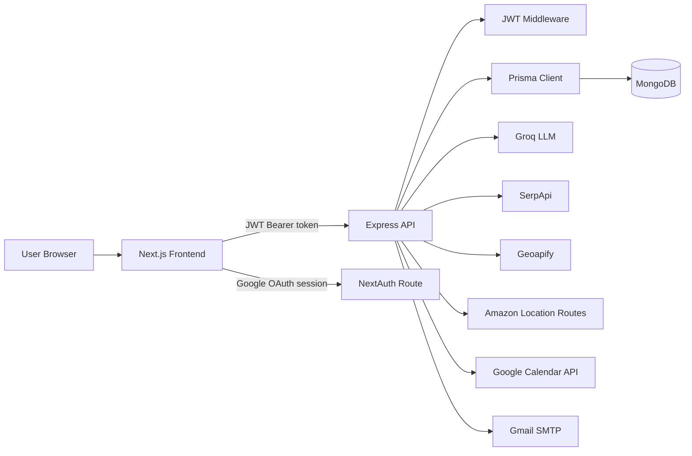
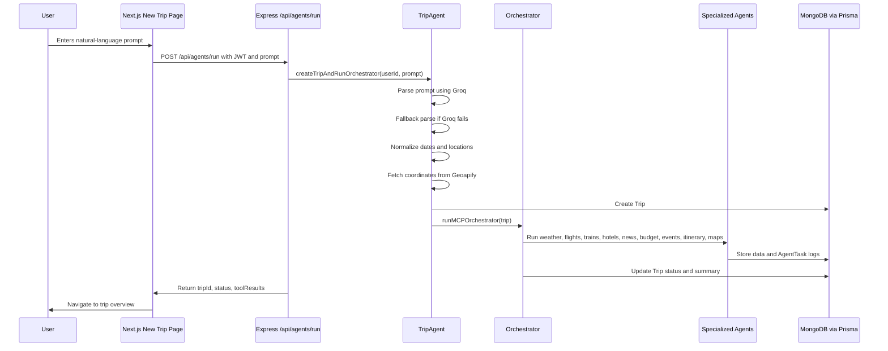
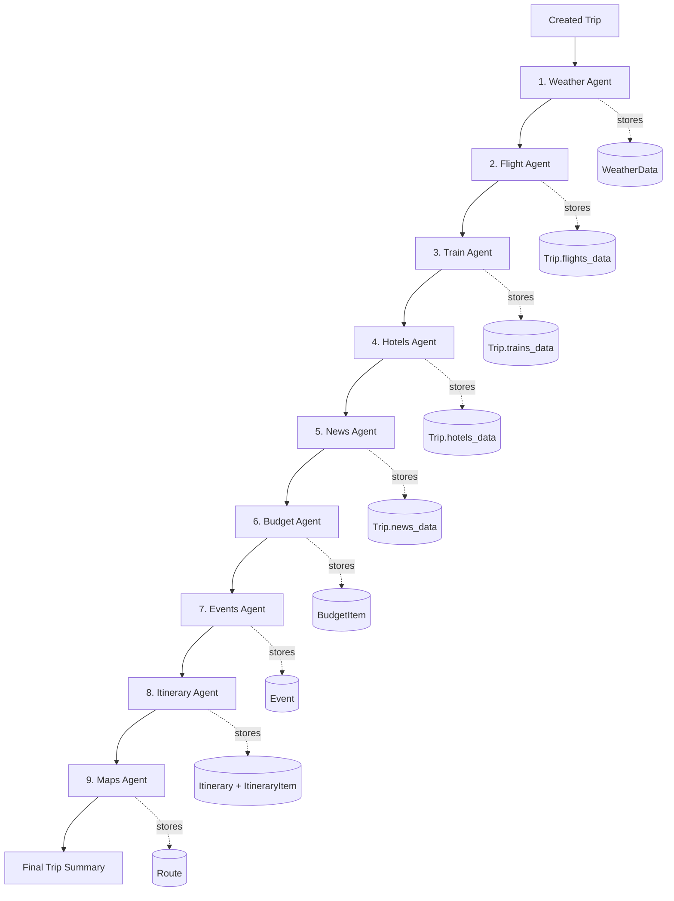
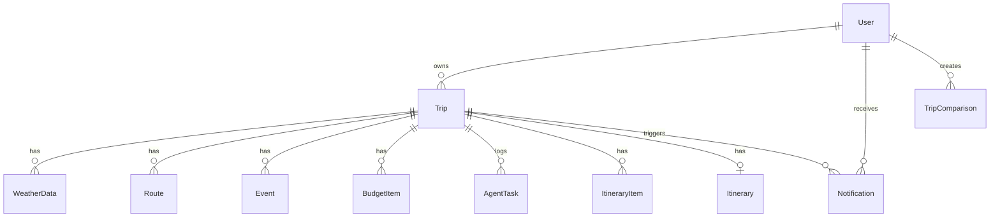
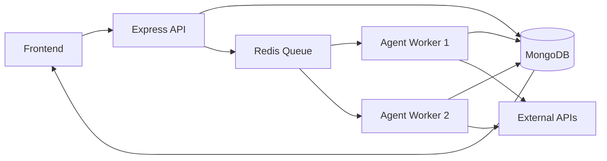

# SmartTravello Interview Preparation Guide

This document is designed to help you explain SmartTravello confidently in technical interviews, especially for product-based companies. It focuses on what the project actually contains today: a Next.js frontend, an Express/Prisma/MongoDB backend, JWT authentication, Google Calendar OAuth, and a sequential multi-agent travel planning workflow powered by Groq and travel data APIs.

## How To Present The Project

### 30-Second Pitch

SmartTravello is an AI-powered travel planning platform that turns a natural-language trip request into a complete, stored travel plan. A user can say something like "Plan a 5-day trip to Mumbai from Delhi," and the system parses the prompt, creates a trip, runs specialized agents for weather, flights, trains, hotels, budget, events, itinerary, news, and routes, and then presents everything in a Next.js dashboard with charts, maps, PDF export, email, and Google Calendar sync.

### 1-Minute Pitch

SmartTravello solves the problem of fragmented travel planning. Usually users search separate websites for flights, hotels, weather, events, maps, budgets, and itineraries. In this project, the user gives one natural-language prompt, and the backend converts it into structured trip data using Groq with a fallback parser. The backend stores the trip in MongoDB through Prisma and runs a sequential orchestrator of domain-specific agents. Each agent writes durable results to the database or the trip JSON fields, and each run is logged in `AgentTask`.

The frontend is built with Next.js App Router and React. It has login/signup, a dashboard, trip creation, trip detail pages, comparison, charts with Recharts, route maps with Leaflet, PDF downloads with PDFKit, and Google Calendar sync through NextAuth and Google APIs. I designed it to be modular: the frontend reads from clean trip-specific API routes, while the backend separates routes, controllers, services, agents, and database access.

### Detailed Explanation

SmartTravello is a full-stack AI travel planning platform. The core idea is to replace manual multi-tab travel research with a guided AI workflow. A user authenticates, enters a natural-language prompt, and the backend handles the rest.

The backend starts by parsing the prompt in `tripAgent.js`. It uses Groq through the OpenAI-compatible SDK to extract fields such as origin, destination, dates, travelers, and budget. If the LLM fails or returns invalid JSON, the project falls back to a deterministic parser that handles common phrases like "next week", "weekend", "from Delhi", or "5-day trip". Dates are normalized into future ranges so old dates do not accidentally create past trips. Geoapify is then used to convert origin and destination into coordinates.

After the trip is stored, the orchestrator runs a fixed sequence of agents. It runs weather first, then flights, trains, hotels, news, budget, events, itinerary, and maps. The order matters because budget uses flight and hotel data, itinerary uses weather and budget context, and maps runs after the itinerary/route context exists. Each agent is attempted even if a previous one fails. That design gives partial but useful trip plans instead of aborting the whole workflow.

On the frontend, the user sees the generated plan through a dashboard and multiple trip detail pages: overview, weather, flights, trains, hotels, budget, events, routes, news, and itinerary. The UI uses client-side data fetching with JWT tokens from `localStorage`, theme persistence, charts, sorting/filtering, and a floating AI chatbot. Google Calendar sync uses NextAuth Google OAuth to get Calendar tokens and then the backend inserts itinerary activities into the user's primary calendar.

The project is not just an AI demo. It includes persistence, authentication, API integration, graceful fallbacks, background emails, PDF generation, maps, charts, and a deployable structure. The main tradeoff is that the orchestrator is currently sequential, which is simpler and dependency-safe but slower than a queue-based or partially parallel production architecture.

## Problem It Solves

Travel planning is scattered across many tools:

- Flights and trains are searched separately.
- Hotels and budgets are planned separately.
- Weather, events, local news, maps, and itinerary planning require manual research.
- Users have to keep copying information between sites.

SmartTravello gives users one starting point:

```text
User prompt
  -> structured trip
  -> travel data collection
  -> budget and itinerary generation
  -> saved dashboard experience
```

The interview-friendly framing:

> I built SmartTravello as an orchestration problem. The hard part was not just calling one AI model. It was converting an ambiguous user prompt into a reliable, persistent workflow where multiple agents collect and generate data, each result is stored, and the user can inspect, compare, export, and sync the final plan.

## Key Features

- Natural-language trip creation.
- Groq-based prompt parsing with fallback parsing.
- Future-date normalization.
- Geoapify geocoding for origin and destination.
- Sequential multi-agent orchestration.
- Agent logging through the `AgentTask` model.
- Weather forecasts using SerpApi Google weather.
- Flight search using SerpApi Google Flights and city-to-airport mapping.
- Train options generated by Groq with simulated fallback options.
- Hotel search using SerpApi Google Hotels.
- Travel news using SerpApi Google News.
- Budget calculation using flight/hotel data when available.
- Events discovery using SerpApi Google Events.
- Itinerary generation using Groq, weather data, and budget context.
- Route calculation using Amazon Location Service Routes API.
- Dashboard, trip cards, comparison page, detail pages, charts, and maps.
- JWT authentication for app users.
- NextAuth Google OAuth for Calendar permissions.
- Google Calendar sync for itinerary activities.
- PDF itinerary download with PDFKit.
- Itinerary and recommendation emails through Nodemailer/Gmail SMTP.
- Scheduled recommendation jobs through node-cron.
- Dark/light theme support.
- Floating authenticated AI chatbot.
- Docker Compose for local MongoDB.

## Architecture

### High-Level System Diagram



### Backend Layering

```text
backend/index.js
  -> loads env, starts server, initializes cron jobs

backend/app.js
  -> Express app, CORS, JSON parsing, route mounting

backend/src/routes/*
  -> endpoint definitions

backend/src/controllers/*
  -> request validation, auth context checks, response formatting

backend/src/agents/*
  -> travel planning domain logic and external API calls

backend/src/services/*
  -> email, cron, recommendation generation

backend/src/config/*
  -> Prisma client and Groq client

backend/prisma/schema.prisma
  -> MongoDB data model
```

### Main Trip Planning Flow



### Agent Execution Flow



## Database Design

The project uses Prisma with MongoDB. Most entities are tied to a `Trip`.



Important models:

- `User`: email, password hash, name, theme preference, Google token field, trips.
- `Trip`: origin, destination, coordinates, dates, adults, status, budget, summary, and JSON fields for flights/hotels/trains/news.
- `WeatherData`: daily forecast records linked to a trip.
- `Route`: route distance, duration, cost, route geometry, and provider response.
- `Event`: destination events with venue, date, category, booking URL, and raw JSON.
- `BudgetItem`: category-level estimated and actual amounts.
- `Itinerary`: full generated plan as JSON.
- `ItineraryItem`: structured daily itinerary rows.
- `AgentTask`: audit log of each agent execution.
- `Notification`: app notification data.
- `TripComparison`: stores comparison criteria/results.

Interview angle:

> I used normalized collections for data the UI queries independently, like weather, events, budget items, routes, and itinerary items. I used JSON fields for third-party result blobs such as flights, hotels, trains, and news because their structures are provider-specific and change more often.

## API Surface

Key backend routes:

| Area | Endpoint | Purpose |
| --- | --- | --- |
| Auth | `POST /api/auth/register` | Create user with bcrypt password hash |
| Auth | `POST /api/auth/login` | Verify password and issue JWT |
| Auth | `GET /api/auth/me` | Get current user from JWT |
| Agents | `POST /api/agents/run` | Create trip and run full planning workflow |
| Trips | `GET /api/trips` | List current user's trips |
| Trips | `GET /api/trips/:id/summary` | Get overview data for one trip |
| Trips | `DELETE /api/trips/:id` | Delete a trip and related data |
| Weather | `GET /api/trips/:id/weather` | Read stored weather data |
| Flights | `GET /api/trips/:id/flights` | Read stored flight data |
| Trains | `GET /api/trips/:id/trains` | Read stored train data |
| Hotels | `GET /api/trips/:id/hotels` | Read stored hotel data |
| News | `GET /api/trips/:id/news` | Read stored news data |
| Budget | `GET /api/trips/:id/budget` | Read budget summary |
| Budget | `GET /api/trips/:id/budget/items` | Read budget items |
| Events | `GET /api/trips/:id/events` | Read stored events |
| Itinerary | `GET /api/trips/:id/itinerary` | Read full itinerary |
| Itinerary | `GET /api/itinerary/download-pdf/:tripId` | Generate itinerary PDF |
| Routes | `GET /api/trips/:id/routes` | Read or calculate stored route |
| Calendar | `POST /api/calendar/sync` | Insert itinerary into Google Calendar |
| Chat | `POST /api/chat` | Authenticated Groq chatbot |
| Cron | `POST /api/cron/trigger-recommendations` | Manual recommendation email trigger |

Security note to mention honestly:

- Most trip routes are protected by `authenticate`.
- The PDF route currently reads a trip by `tripId` without Express auth in the route. A strong improvement would be to protect it and verify `trip.user_id === req.user.userId`.
- Cron test/trigger routes are currently open and should be restricted in production.

## Frontend Workflow

```text
/                      Landing page
/login                 JWT login
/signup                User registration
/dashboard             User home, stats, recent trips, chatbot
/dashboard/new         Natural-language trip creation
/dashboard/trips       Trip list and deletion
/dashboard/compare     Compare up to 4 trips
/dashboard/trip/:id/overview
                       Hub for generated modules
/dashboard/trip/:id/weather
                       Forecast data and Recharts visualizations
/dashboard/trip/:id/flights
                       Flight tabs and sorting
/dashboard/trip/:id/trains
                       Train sorting and details
/dashboard/trip/:id/hotels
                       Hotel sorting and amenities
/dashboard/trip/:id/budget
                       Budget summary and pie chart
/dashboard/trip/:id/events
                       Event filters and recommendation toggle
/dashboard/trip/:id/routes
                       Route cards and Leaflet map modal
/dashboard/trip/:id/news
                       Destination news cards
/dashboard/trip/:id/itinerary
                       Daily itinerary, PDF download, Google Calendar sync
```

## Technology Deep Dive

### Complete Stack Inventory

Use this as a fast revision table before interviews.

| Category | Technology | Where it appears | Interview framing |
| --- | --- | --- | --- |
| Frontend framework | Next.js 15 App Router | `frontend/src/app` | Routing, layouts, frontend API routes, production React structure |
| UI library | React 19 | Dashboard pages and components | Stateful component model for interactive trip views |
| Language | TypeScript | Frontend pages/API routes | Safer UI contracts and editor support |
| Styling | Tailwind CSS | All frontend pages | Utility-first styling and dark mode |
| Icons | lucide-react | Dashboard/auth/trip pages | Consistent visual actions and statuses |
| Charts | Recharts | Weather and budget pages | Data visualization for forecasts and costs |
| Maps | Leaflet + OpenStreetMap tiles | Routes page | Browser map rendering for stored route data |
| Auth UI/OAuth | NextAuth | Frontend auth route and itinerary page | Google Calendar OAuth and token refresh |
| HTTP clients | Fetch API + Axios | Frontend pages and `src/lib/api.ts` | API calls with Bearer tokens |
| Backend runtime | Node.js | Backend app | JavaScript server runtime |
| Backend framework | Express 5 | `backend/app.js`, routes/controllers | REST API routing and middleware |
| Database ORM | Prisma Client | Backend controllers/agents | Schema-backed MongoDB access |
| Database | MongoDB 7 | Docker Compose / Atlas-ready | Flexible JSON-heavy trip data storage |
| Password auth | bcrypt | Auth controller | Password hashing |
| Token auth | jsonwebtoken | Auth controller/middleware | Stateless API authorization |
| Runtime validation | Zod | Agents | Validate dynamic agent inputs |
| AI client | OpenAI SDK with Groq base URL | `config/groq.js` | LLM access through Groq |
| Travel data | SerpApi | Weather/flights/hotels/news/events agents | Third-party travel/search data |
| Geocoding | Geoapify | Trip creation | Convert locations to coordinates |
| Routing | Amazon Location Service | Maps agent | Route distance, geometry, and steps |
| Calendar | Google APIs | Calendar controller/frontend route | Insert itinerary events |
| Email | Nodemailer + Gmail SMTP | Email service | Itinerary and recommendation emails |
| Scheduling | node-cron | Cron service | Scheduled recommendation jobs |
| PDF | PDFKit | Itinerary agent/PDF route | Generate downloadable itineraries |
| Config | dotenv | Backend startup/config | Environment variable loading |
| CORS | cors | Express app/index | Allow frontend-backend calls |
| Dev tooling | Nodemon, ESLint, npm | Package scripts/config | Local DX and linting |
| Local infra | Docker Compose | `docker/docker-compose.yml` | MongoDB container for local development |
| Landing animation | GSAP CDN | Landing page | Scroll/hero animation |
| Fonts/media | Next fonts, Google Fonts, local video | Layout and landing page | Visual polish and branding |

Important caveat:

> Some packages are installed but not meaningfully used in the active flow. Be honest about that. Product interviewers generally prefer clear ownership over inflated claims.

### Next.js 15 App Router

Why chosen:

- File-based routing fits a dashboard with many pages.
- App Router supports server route handlers, layout composition, and client components.
- Next.js is widely used in product companies and gives a strong React production story.

Where used:

- `frontend/src/app/*`
- `frontend/src/app/api/auth/[...nextauth]/route.ts`
- `frontend/src/app/api/calender/sync/route.ts`

Common interview question:

> Why did you use Next.js instead of plain React?

Ideal answer:

> The app needs multiple routes, shared layout, auth integration, and API route handlers for Google OAuth. Next.js gives routing and application structure out of the box. In this project most dashboard pages are client components because they depend on `localStorage`, client navigation, and interactive sorting/filtering.

Follow-up:

> What would you move server-side?

Ideal answer:

> I would move authenticated data fetching toward server-side route handlers or server components with secure cookies, but because the current JWT is in `localStorage`, the pages fetch data client-side.

### React 19

Why chosen:

- Component-based UI for a multi-page, stateful dashboard.
- Hooks simplify local UI state such as loading, errors, sorting, filters, tabs, expanded days, and modal maps.

Where used:

- All `page.tsx` dashboard pages.
- `Chatbot.jsx`.
- `ThemeContext.tsx`.

Common interview question:

> How did you manage state?

Ideal answer:

> I used local component state for page-specific concerns like loading, selected filters, active tabs, selected routes, and expanded itinerary days. I used React Context only for cross-cutting theme state. Server data is fetched per page from backend endpoints.

Follow-up:

> Would you add Redux?

Ideal answer:

> Not for the current scope. Most state is local and route-specific. If the app grows with shared trip caches, optimistic updates, or offline behavior, I would prefer React Query or SWR before Redux.

### TypeScript

Why chosen:

- Safer frontend data contracts.
- Better maintainability across multiple trip detail pages.
- Useful interfaces for API response shapes.

Where used:

- Frontend pages and NextAuth route.
- TypeScript config in `frontend/tsconfig.json`.

Common interview question:

> How does TypeScript help this project?

Ideal answer:

> It catches mismatches between expected API responses and UI usage. For example, pages define interfaces for `BudgetData`, `Flight`, `HotelData`, `WeatherDay`, and `Route`, making transformations and rendering safer.

Follow-up:

> Is the backend typed?

Ideal answer:

> The backend is JavaScript ES modules, so runtime validation is handled with Zod in agents. A future improvement would be moving backend code to TypeScript and generating shared API types.

### Tailwind CSS

Why chosen:

- Fast styling for a dashboard-heavy UI.
- Utility classes make state-based styling straightforward.
- Supports class-based dark mode.

Where used:

- All frontend pages.
- `tailwind.config.js` uses `darkMode: 'class'`.
- `ThemeContext` toggles the `dark` class on `<html>`.

Common interview question:

> How is dark mode implemented?

Ideal answer:

> The app stores the theme in `localStorage`, applies a `dark` class to the document root, and uses Tailwind's class-based dark mode. The root layout also injects a small script to apply the saved theme before hydration, reducing theme flicker.

Follow-up:

> What is a limitation?

Ideal answer:

> Some pages manage theme locally while others use the shared context. I would standardize all pages on the `ThemeContext`.

### lucide-react and Icons

Why chosen:

- Clean, consistent icon set for dashboard actions and statuses.
- Lightweight and easy to use inside buttons/cards.

Where used:

- Dashboard, auth pages, trip detail pages, chatbot.

Common interview question:

> Why use an icon library?

Ideal answer:

> Icons improve scanability in a dense travel dashboard. A shared icon library keeps the visual language consistent and avoids custom SVG maintenance.

### Recharts

Why chosen:

- React-native chart components.
- Easy responsive charts for budget and weather views.

Where used:

- Weather page uses line and responsive charts.
- Budget page uses a pie chart.

Common interview question:

> What data visualization did you add?

Ideal answer:

> Weather trends are visualized so users can compare temperature and precipitation by day. Budget data is visualized as category breakdowns, making major cost drivers easy to see.

Follow-up:

> How would you handle large chart datasets?

Ideal answer:

> I would paginate or aggregate on the backend, memoize transformed chart data, and avoid rendering thousands of chart points at once.

### Leaflet and OpenStreetMap Tiles

Why chosen:

- Open-source map rendering.
- Simple route visualization without needing a Google Maps frontend key.

Where used:

- Routes page dynamically imports Leaflet and renders markers, route step popups, and a polyline.
- `leaflet/dist/leaflet.css` is loaded in the root layout.

Common interview question:

> Why dynamic import Leaflet?

Ideal answer:

> Leaflet depends on browser APIs, so dynamic import prevents server-side rendering issues in Next.js and only loads the map code when the map modal is needed.

### Axios and Fetch API

Why chosen:

- Axios helper centralizes auth headers for login/register/current user helpers.
- Native `fetch` is used directly in most pages for route-specific backend calls.

Where used:

- `frontend/src/lib/api.ts` uses Axios with an interceptor.
- Dashboard pages use `fetch` directly.

Common interview question:

> Why are both Axios and fetch used?

Ideal answer:

> Axios is used for the shared auth helper, while most pages currently use direct fetch calls. A cleanup improvement would be to standardize on one API client and move the base URL to `NEXT_PUBLIC_API_URL`.

### NextAuth

Why chosen:

- Handles Google OAuth consent and token refresh for Calendar access.
- Keeps Google OAuth separate from the app's JWT login system.

Where used:

- `frontend/src/app/api/auth/[...nextauth]/route.ts`
- `frontend/src/app/dashboard/trip/[id]/itinerary/page.tsx`

Common interview question:

> Why do you have JWT auth and NextAuth?

Ideal answer:

> They solve different problems. The app's own authentication uses email/password and JWT for backend authorization. NextAuth is used specifically for Google OAuth so the user can grant Calendar permissions. The itinerary page combines both: JWT proves app identity to the backend, while Google OAuth tokens authorize Calendar insertion.

Follow-up:

> Would you unify them?

Ideal answer:

> In production I would likely use one session strategy, preferably secure HTTP-only cookies, and link Google OAuth tokens to the authenticated app user.

### Node.js and Express 5

Why chosen:

- Straightforward REST API for a full-stack JavaScript project.
- Good ecosystem for Prisma, JWT, email, cron, and external APIs.
- Express route/controller style keeps backend understandable.

Where used:

- `backend/app.js`
- `backend/index.js`
- `backend/src/routes/*`
- `backend/src/controllers/*`

Common interview question:

> How is the backend structured?

Ideal answer:

> It uses Express with route files for endpoints, controllers for request handling, agents for travel domain logic, services for email/cron/recommendations, and config files for Prisma and Groq clients.

Follow-up:

> What would you improve?

Ideal answer:

> I would add centralized validation for all request bodies, structured logging, rate limiting, better error classes, and integration tests around core workflows.

### Prisma

Why chosen:

- Strong schema layer over MongoDB.
- Cleaner database access than raw Mongo queries.
- Models relationships between users, trips, and generated trip data.

Where used:

- `backend/prisma/schema.prisma`
- `backend/src/config/db.js`
- Controllers and agents use `prisma.*`.

Common interview question:

> Why use Prisma with MongoDB?

Ideal answer:

> Prisma gives a consistent model layer and relation-like access patterns while still using MongoDB's flexible document storage. That is useful here because some provider responses are JSON-heavy, while other entities like budget items and itinerary items need structured querying.

Follow-up:

> Any Prisma/MongoDB caveats?

Ideal answer:

> Prisma's MongoDB support has constraints around ObjectId fields and transaction behavior. For production, MongoDB Atlas or a replica set is safer than a standalone local instance.

### MongoDB

Why chosen:

- Flexible schema for travel API responses and AI-generated data.
- Works well for JSON-heavy trip summaries, route responses, hotel data, and news.
- Natural fit for fast iteration in a project with evolving agent outputs.

Where used:

- Stores users, trips, weather, events, budget items, routes, itineraries, notifications, comparisons, and agent task logs.

Common interview question:

> Why not use PostgreSQL?

Ideal answer:

> PostgreSQL would be strong for relational consistency and analytics, but MongoDB fits this project because many third-party and AI outputs are nested JSON with evolving shapes. I still normalized frequently queried data like weather, budget, routes, events, and itinerary items into separate collections.

Follow-up:

> How would you index it?

Ideal answer:

> I would add indexes on `Trip.user_id`, `Trip.created_at`, `WeatherData.trip_id/date`, `Event.trip_id/start_datetime`, `BudgetItem.trip_id`, `Route.trip_id`, and `AgentTask.trip_id/started_at`.

### JWT and bcrypt

Why chosen:

- JWT protects backend APIs without server-side session storage.
- bcrypt securely hashes user passwords.

Where used:

- `auth.controller.js` hashes passwords and signs tokens.
- `auth.middleware.js` verifies `Authorization: Bearer <token>`.

Common interview question:

> How does login work?

Ideal answer:

> During registration the password is hashed with bcrypt. During login the backend finds the user by email, compares the password against the stored hash, and returns a signed JWT containing `userId` and email. Protected routes verify the token and read `req.user.userId`.

Follow-up:

> What is the security tradeoff?

Ideal answer:

> The frontend stores JWTs in `localStorage`, which is simple but vulnerable to token theft if XSS occurs. A production version should use secure, HTTP-only, SameSite cookies and CSRF-aware flows.

### Zod

Why chosen:

- Runtime validation for agent inputs.
- Protects external API calls from malformed arguments.

Where used:

- Weather, flights, hotels, trains, maps, budget, events, news, and itinerary agents.

Common interview question:

> Why use Zod if JavaScript has no compile-time types?

Ideal answer:

> Zod gives runtime validation at boundaries. Agents receive dynamic data from the orchestrator and user prompts, so validating fields like Mongo ObjectIds, dates, and enums prevents invalid API calls and bad database writes.

### Groq and OpenAI-Compatible SDK

Why chosen:

- Fast LLM inference.
- OpenAI-compatible SDK makes integration simple.
- Used for natural-language parsing, itinerary POIs, train options, chatbot, recommendations, and final trip summaries.

Where used:

- `backend/src/config/groq.js`
- `tripAgent.js`
- `trainAgent.js`
- `itineraryAgent.js`
- `orchestrator.js`
- `chat.controller.js`
- `recommendationService.js`

Common interview question:

> How do you make LLM output reliable?

Ideal answer:

> I ask the model for strict JSON, strip code fences, parse the output, and validate the shape with code or Zod. For critical parsing, I also have a deterministic fallback parser, so trip creation still works when the LLM fails.

Follow-up:

> What would you improve?

Ideal answer:

> I would use schema-constrained outputs or function calling where supported, add retries with validation feedback, store prompt/version metadata, and evaluate outputs against test prompts.

### SerpApi

Why chosen:

- Gives access to Google-like travel result surfaces without scraping directly.
- Used for multiple travel domains through one provider.

Where used:

- Weather: Google weather.
- Flights: Google Flights.
- Hotels: Google Hotels.
- News: Google News.
- Events: Google Events.

Common interview question:

> What happens if SerpApi fails?

Ideal answer:

> Most agents catch API errors and either return empty structured data or fallback data. This keeps the trip workflow usable. The orchestrator also logs failures and continues to the next agent.

### Geoapify

Why chosen:

- Converts human-readable origin/destination names into coordinates.
- Coordinates are needed for maps and route calculations.

Where used:

- `tripAgent.js` fetches coordinates before creating a trip.

Common interview question:

> Why geocode during trip creation?

Ideal answer:

> It makes coordinates durable. Later agents and frontend pages can use stored coordinates instead of geocoding repeatedly, which reduces latency and API calls.

### Amazon Location Service Routes API

Why chosen:

- Provides route distance, duration, turn-by-turn steps, and route geometry.
- Used by backend so routing logic and API keys stay server-side.

Where used:

- `mapsAgent.js`
- `GET /api/trips/:id/routes` can calculate a route on demand if missing.

Common interview question:

> How does route rendering work?

Ideal answer:

> The backend calls Amazon Location Routes using stored origin and destination coordinates, stores route summary and a Google-compatible step structure, and the frontend renders markers and polylines with Leaflet.

### Google APIs and Calendar OAuth

Why chosen:

- Lets users convert itinerary activities into real calendar events.
- Good example of OAuth-based third-party integration.

Where used:

- NextAuth route gets Google tokens.
- Backend `calendar.controller.js` inserts events into Google Calendar.
- Frontend itinerary page calls `signIn("google")` and sends Google token headers to the backend sync route.

Common interview question:

> How do you validate calendar events?

Ideal answer:

> The backend checks that the itinerary is an array, each event has summary/start/end, dates are parseable, and end time is after start time before inserting into Calendar.

### Nodemailer and Gmail SMTP

Why chosen:

- Simple way to send itinerary and recommendation emails.
- Gmail app passwords work for local/demo environments.

Where used:

- `emailService.js`
- `emailUtils.js`
- `itineraryAgent.js`
- `recommendationService.js`

Common interview question:

> Should Gmail SMTP be used in production?

Ideal answer:

> For a demo it is fine, but production should use a transactional email provider like SES, SendGrid, or Postmark, with proper domain verification, retries, suppression handling, and templates.

### node-cron

Why chosen:

- Lightweight scheduled tasks.
- Sends travel recommendation emails based on recent trips.

Where used:

- `cronServices.js`
- `index.js` initializes cron jobs after server start.

Common interview question:

> What is the limitation of node-cron?

Ideal answer:

> It runs inside the server process, so multiple backend instances can duplicate jobs, and jobs stop if the process restarts. In production I would use a queue or managed scheduler with distributed locking.

### PDFKit

Why chosen:

- Generates itinerary PDFs programmatically on the backend.
- Streams a downloadable PDF buffer.

Where used:

- `itineraryAgent.js` exports `generatePdfBuffer`.
- `itinerary.routes.js` handles `GET /api/itinerary/download-pdf/:tripId`.

Common interview question:

> Why generate PDFs on the backend?

Ideal answer:

> Backend generation keeps formatting deterministic, avoids heavy browser logic, and can also be reused for email attachments or exports.

### Docker Compose

Why chosen:

- Provides a repeatable local MongoDB 7 environment.
- Avoids requiring every developer to install MongoDB manually.

Where used:

- `docker/docker-compose.yml`.

Important interview caveat:

> The project currently uses Docker Compose only for MongoDB. The backend and frontend Dockerfiles exist but are empty placeholders. A productionization improvement would be to containerize both services and add a full Compose setup or cloud deployment pipeline.

Common interview question:

> How would you Dockerize the whole app?

Ideal answer:

> I would create a multi-stage Dockerfile for the Next.js frontend, a Node.js image for the Express backend with Prisma generate during build, add `.dockerignore`, pass environment variables securely, and connect services through Compose networking.

### Supporting Technologies

These technologies are smaller parts of the project, but they are still worth being able to explain.

**CORS**

Where used:

- `backend/app.js`
- `backend/index.js`

Question:

> Why is CORS configured?

Ideal answer:

> The frontend runs on `localhost:3000` and the backend on `localhost:5000`, which are different origins. CORS allows the browser to call the backend while still controlling allowed origins, methods, credentials, and headers.

Improvement:

> CORS is currently configured in both `app.js` and `index.js`. I would centralize it in one place and make the allowed origin environment-based.

**dotenv**

Where used:

- `backend/index.js`
- `backend/src/config/db.js`
- `backend/src/config/groq.js`

Question:

> Why use environment variables?

Ideal answer:

> Secrets and environment-specific values like database URLs, API keys, JWT secrets, OAuth credentials, and email credentials should not be hardcoded. dotenv loads them locally; production should use platform-managed secrets.

**node-fetch and native fetch**

Where used:

- `tripAgent.js` imports `node-fetch` for Geoapify geocoding.
- `mapsAgent.js` uses `fetch` for Amazon Location.

Question:

> What are these used for?

Ideal answer:

> They are used for direct HTTP calls where there is no wrapper SDK in this project. Geoapify geocoding and Amazon Location routing are called with HTTP requests.

**GSAP CDN and media assets**

Where used:

- Landing page loads GSAP/ScrollTrigger scripts.
- Landing page uses a local hero video and remote destination images.

Question:

> Why use animations and media?

Ideal answer:

> The dashboard is utilitarian, but the public landing page benefits from a travel-oriented visual first impression. The core product still starts after login; the media is mainly for acquisition/presentation.

**ES modules**

Where used:

- Backend `package.json` has `"type": "module"`.
- Backend uses `import`/`export`.

Question:

> Why mention ES modules?

Ideal answer:

> It keeps backend syntax aligned with modern JavaScript and the frontend ecosystem, but it also means imports need explicit file extensions in local modules.

**Nodemon and ESLint**

Where used:

- Backend `dev`/`start` uses Nodemon.
- Frontend has ESLint with Next core web vitals and TypeScript config.

Question:

> What tooling supports development quality?

Ideal answer:

> Nodemon improves backend iteration by restarting on changes. ESLint catches frontend issues early. I would add automated tests and CI as the next quality layer.

### ESLint, Nodemon, and Tooling

Why chosen:

- ESLint catches frontend code quality issues.
- Nodemon restarts the backend during development.
- npm scripts provide predictable local workflows.

Where used:

- `frontend/eslint.config.mjs`
- `backend/package.json`
- `frontend/package.json`

Common interview question:

> What tests/tooling would you add?

Ideal answer:

> I would add unit tests for parsers and budget calculations, integration tests for auth/trip APIs, Playwright tests for the main user flow, and CI checks for lint/build/test.

### Installed But Not Actively Wired Yet

The backend package includes some dependencies that are not actively used in current source imports, such as LangChain/LangGraph, Bull, Redis/ioredis, Socket.IO, OpenRouteService, `@google/generative-ai`, `bcryptjs`, backend Leaflet packages, and date-fns/date-fns-tz. The frontend package includes `@heroicons/react` but the active UI uses lucide-react; `framer-motion` is present and lightly imported in a couple of pages but is not central to the current product behavior.

How to answer if asked:

> Some packages are present from experimentation or future extensions. In the current implementation, the active AI integration is Groq through the OpenAI-compatible SDK, the active scheduler is node-cron, and the active map backend is Amazon Location. A cleanup task would be to remove unused dependencies or wire them intentionally, for example Bull/Redis for background agent jobs.

## Design Decisions

### Sequential Orchestrator

Decision:

- Run agents in a fixed order.

Why:

- Some agents depend on previous outputs.
- Easier debugging.
- Guarantees every agent is attempted and logged.

Tradeoff:

- Slower than parallel execution.

Improvement:

- Parallelize independent agents after weather, such as flights/trains/hotels/news, then run budget/events/itinerary/maps sequentially.

### Fallbacks Instead Of Hard Failure

Decision:

- Use fallback prompt parsing, fallback weather, fallback trains, fallback hotels, and fallback news.

Why:

- Users should get partial value even when one API fails.

Tradeoff:

- Fallback data must be clearly labeled to avoid misleading users.

Improvement:

- Add confidence/source labels to every generated item in the UI.

### JSON Fields For Provider Data

Decision:

- Store flights, hotels, trains, and news in JSON fields on `Trip`.

Why:

- These response shapes are nested and provider-specific.
- Fast iteration without migrating many collections.

Tradeoff:

- Harder to query/filter globally across trips.

Improvement:

- Normalize provider data if the product needs global analytics or search.

### LocalStorage JWT

Decision:

- Store app JWT in `localStorage`.

Why:

- Simple frontend implementation.

Tradeoff:

- Higher XSS risk than HTTP-only cookies.

Improvement:

- Use secure HTTP-only SameSite cookies and refresh-token rotation.

### Separate JWT Auth And Google OAuth

Decision:

- Use app JWT for SmartTravello authentication and NextAuth for Google Calendar OAuth.

Why:

- App login and Google Calendar authorization are different concerns.

Tradeoff:

- More complex mental model.

Improvement:

- Link OAuth accounts to app users in the database and use one session strategy.

## Challenges Faced And How To Explain Them

### LLM Output Reliability

Challenge:

- LLMs may return malformed JSON, missing fields, or old dates.

Solution:

- Strict JSON prompts.
- JSON cleanup.
- Fallback deterministic parser.
- Future-date normalization.

Interview phrasing:

> I treated LLM output as untrusted input. The LLM helps with flexibility, but deterministic code validates and normalizes the result before it reaches the database.

### External API Failures

Challenge:

- Travel APIs can fail, return incomplete data, or have unsupported cities.

Solution:

- Per-agent try/catch.
- Structured fallback responses.
- `AgentTask` logs.
- Orchestrator continues after failure.

### Long-Running Trip Creation

Challenge:

- Running nine agents sequentially can take time.

Solution:

- Frontend shows agent progress.
- Backend returns detailed tool results.

Improvement:

- Move agent work into background jobs with polling, WebSocket/SSE updates, and retry queues.

### Calendar Token Handling

Challenge:

- Google access tokens expire.

Solution:

- NextAuth JWT callback refreshes the token when possible.
- Backend accepts Google token headers for Calendar sync.

Improvement:

- Store encrypted OAuth tokens server-side and avoid passing them through client headers.

### Data Shape Compatibility

Challenge:

- Different agents produce different output shapes.

Solution:

- Controllers format responses for frontend pages.
- Route/map data is converted into a Google-compatible step format for easier frontend rendering.

## Scalability Discussion

Current design:

- One Express process handles API requests and agent orchestration.
- Agent execution is sequential.
- MongoDB stores all data.
- node-cron runs inside the server process.

Potential bottlenecks:

- Long request time for `/api/agents/run`.
- External API rate limits.
- Duplicate cron jobs if multiple backend instances run.
- No shared cache for repeated destination searches.
- No queue-based retry strategy.

Production improvements:

- Use BullMQ with Redis for background agent jobs.
- Return `tripId` immediately and process agents asynchronously.
- Use SSE or WebSockets for live progress.
- Parallelize independent agents.
- Add caching for destination weather/news/hotel searches where valid.
- Add indexes on trip-scoped collections.
- Add API rate limiting and request timeouts.
- Move cron to a managed scheduler or distributed worker.
- Store secrets in a cloud secret manager.
- Add observability: structured logs, traces, metrics, and alerting.

Scalable target flow:



## Security Discussion

What is already present:

- Passwords are hashed with bcrypt.
- JWTs have expiration.
- Protected backend routes use JWT middleware.
- Most trip reads verify `user_id`.
- Calendar sync verifies trip ownership when `tripId` is provided.
- CORS is restricted to `http://localhost:3000` for local development.

Risks and improvements:

- Store JWT in HTTP-only cookies instead of `localStorage`.
- Protect PDF download route with JWT and ownership checks.
- Protect cron trigger routes.
- Add rate limiting to auth and AI routes.
- Validate all request payloads, not only agent inputs.
- Avoid logging sensitive tokens or secrets.
- Encrypt stored OAuth tokens if persisted.
- Add Helmet/security headers.
- Add refresh-token rotation.
- Add CSRF protection if moving to cookies.
- Add input length limits for prompts/chat messages.
- Add audit logs for destructive actions like trip deletion.

## Deployment Discussion

Current local setup:

```text
Docker Compose starts MongoDB
Backend runs locally on port 5000
Frontend runs locally on port 3000
Frontend calls backend at http://localhost:5000/api
```

Deployment-ready explanation:

> Today the app is optimized for local/demo execution. For production I would deploy the frontend on Vercel or a Node-compatible platform, the backend on Render/Fly/AWS/ECS, MongoDB on Atlas, and configure environment variables for Groq, SerpApi, Geoapify, AWS Location, Google OAuth, JWT, and email. I would also replace hardcoded localhost API URLs with environment-based configuration.

Production checklist:

- Containerize backend and frontend.
- Add `.dockerignore`.
- Use MongoDB Atlas.
- Run `prisma generate` during backend build.
- Use environment variables, not committed secrets.
- Configure CORS for the real frontend domain.
- Configure Google OAuth redirect URIs for production.
- Add CI pipeline for lint/build/tests.
- Add logs and health checks.
- Add API gateway or reverse proxy if needed.

## Possible Improvements

High-impact improvements:

- Background job queue for agent orchestration.
- Real-time progress updates instead of simulated frontend progress.
- Standardized API client on the frontend.
- Server-side auth with HTTP-only cookies.
- Protect PDF and cron routes.
- Add database indexes.
- Add integration tests for the full trip workflow.
- Add caching and rate-limit handling for external APIs.
- Normalize status values between backend and frontend.
- Include train agent in the frontend progress list.
- Clean unused dependencies.
- Store `last_calendar_sync` only after adding it to the Prisma schema.
- Add proper email unsubscribe handling.
- Add retry/backoff policies per external API.
- Add observability and dashboards.

Product improvements:

- Collaborative trip planning.
- Editable itinerary items.
- Budget actual expense tracking.
- Personalized recommendations based on travel history.
- Saved travelers and preferences.
- Multi-currency support.
- Offline PDF/email generation history.
- Mobile-first trip companion mode.

## Project-Specific Interview Questions And Ideal Answers

### Basic Questions

**Q: What is SmartTravello?**

A: SmartTravello is a full-stack AI travel planning platform. It lets a user enter a natural-language trip prompt, then creates a structured trip and runs specialized agents for weather, transport, hotels, events, budget, itinerary, news, and routes. The generated data is stored and displayed in a Next.js dashboard.

Likely follow-up: What makes it different from a simple chatbot?

Ideal follow-up answer: It does not only generate text. It persists structured data, calls real travel APIs, logs each agent run, and lets users inspect/export/sync the plan.

**Q: What is the core user flow?**

A: A user signs up or logs in, goes to the dashboard, creates a new trip with a prompt, the backend parses and stores the trip, the orchestrator runs the agents, and the user lands on the trip overview where they can open weather, flights, hotels, budget, itinerary, events, routes, and news pages.

Likely follow-up: Which endpoint starts the workflow?

Ideal follow-up answer: `POST /api/agents/run`, protected by JWT.

**Q: What are the main entities in the database?**

A: `User`, `Trip`, `WeatherData`, `Route`, `Event`, `BudgetItem`, `Itinerary`, `ItineraryItem`, `AgentTask`, `Notification`, and `TripComparison`.

Likely follow-up: Why have both `Itinerary` and `ItineraryItem`?

Ideal follow-up answer: `Itinerary` stores the full generated plan JSON, while `ItineraryItem` stores structured daily rows that are easier to query, sort, display, sync, or extend.

**Q: What happens if one agent fails?**

A: The orchestrator logs that failure in `AgentTask`, records the error in the tool results, and continues with the remaining agents. The final status becomes partial success if not all tools succeeded.

Likely follow-up: Why continue instead of aborting?

Ideal follow-up answer: Partial travel data is still useful. For example, if events fail, the user can still get weather, hotels, budget, routes, and itinerary.

### Frontend Questions

**Q: How is routing implemented on the frontend?**

A: The frontend uses Next.js App Router. Pages live under `frontend/src/app`, and dynamic trip pages use `/dashboard/trip/[id]/...`.

Likely follow-up: Why are many pages client components?

Ideal follow-up answer: They depend on browser-only behavior like `localStorage`, dynamic sorting/filtering, maps, and client navigation.

**Q: How does the frontend authenticate API calls?**

A: On login, the backend returns a JWT and user data. The frontend stores the token in `localStorage` and sends it as `Authorization: Bearer <token>` for protected backend routes.

Likely follow-up: Is `localStorage` ideal?

Ideal follow-up answer: It is simple for a demo, but production should use secure HTTP-only cookies to reduce XSS token theft risk.

**Q: How does the route map work?**

A: The backend stores route data from Amazon Location in a Google-compatible shape. The frontend route page dynamically imports Leaflet, creates markers for route steps, draws a polyline, and opens a modal map.

Likely follow-up: Why dynamically import Leaflet?

Ideal follow-up answer: Leaflet needs browser APIs, so dynamic import avoids SSR errors in Next.js.

**Q: How are charts implemented?**

A: Recharts is used. The budget page renders a pie chart for category breakdown, and the weather page renders temperature/precipitation visualizations.

Likely follow-up: How would you optimize chart rendering?

Ideal follow-up answer: Memoize transformed chart data, avoid unnecessary state updates, and aggregate or paginate large datasets.

### Backend Questions

**Q: How is the backend organized?**

A: `app.js` mounts middleware and routers. Routes define endpoints. Controllers handle request context and responses. Agents handle domain-specific travel logic and external API calls. Services handle email, cron, and recommendations. Prisma config centralizes database access.

Likely follow-up: What pattern is this?

Ideal follow-up answer: It is a layered route-controller-service/agent architecture.

**Q: How does the orchestrator work?**

A: It cleans old trip-generated data, runs nine agents in a fixed sequence, logs each run to `AgentTask`, stores results in the database, generates a final AI summary, and updates the trip status and summary.

Likely follow-up: Why clean old data first?

Ideal follow-up answer: It prevents duplicate weather/events/budget/itinerary/route data when re-running agents for the same trip.

**Q: Why is the workflow sequential?**

A: It is dependency-safe and easy to reason about. Budget depends on transport/accommodation data, itinerary depends on weather/budget/events, and maps runs after trip coordinates exist.

Likely follow-up: Could it be faster?

Ideal follow-up answer: Yes. Weather, flights, trains, hotels, and news could be parallelized once the trip exists. Budget/events/itinerary/maps can then run in dependency order.

**Q: How is input validation handled?**

A: Agent inputs are validated with Zod. Auth routes and some controller payloads use manual checks. A future improvement is adding Zod schemas for all controller inputs.

Likely follow-up: Why validate agent inputs?

Ideal follow-up answer: Agents call external APIs and write to the database. Validation prevents malformed dates, invalid ObjectIds, or unsupported enum values from causing hard-to-debug failures.

### Database Questions

**Q: Why MongoDB?**

A: The project stores a mix of structured trip data and flexible JSON from external APIs and LLM outputs. MongoDB is convenient for evolving nested data, while Prisma gives a schema and typed access layer.

Likely follow-up: What would be harder with MongoDB?

Ideal follow-up answer: Complex relational analytics and joins are harder than in PostgreSQL. If the product needed heavy reporting across users and trips, I would evaluate PostgreSQL or a separate analytics pipeline.

**Q: Why store flights/hotels/trains/news on `Trip` as JSON?**

A: Those are provider-shaped result blobs with variable nested structures. Storing them as JSON makes integration faster and avoids over-normalizing unstable data.

Likely follow-up: When would you normalize them?

Ideal follow-up answer: If the app needed cross-trip search, price trend analytics, provider comparisons, or user-level recommendations based on individual flight/hotel records.

**Q: What indexes would you add?**

A: Indexes on `Trip.user_id`, `Trip.created_at`, `WeatherData.trip_id/date`, `Event.trip_id/start_datetime`, `BudgetItem.trip_id`, `Route.trip_id`, `ItineraryItem.trip_id/day_number`, and `AgentTask.trip_id/started_at`.

Likely follow-up: Why?

Ideal follow-up answer: Most read queries are scoped by trip or user and ordered by date or creation time.

### Authentication Questions

**Q: Explain registration and login.**

A: Registration checks if the email exists, hashes the password with bcrypt, and creates the user. Login finds the user by email, compares the password, and signs a JWT containing `userId` and email.

Likely follow-up: What does the middleware do?

Ideal follow-up answer: It reads the Bearer token, verifies it with `JWT_SECRET`, and attaches the decoded payload to `req.user`.

**Q: How does Google Calendar auth work?**

A: NextAuth handles Google OAuth with Calendar scopes. The itinerary page uses the session tokens and sends them along with the app JWT to the backend calendar sync endpoint. The backend verifies the app user and inserts events into Google Calendar.

Likely follow-up: Is passing Google tokens in headers ideal?

Ideal follow-up answer: It works for a demo, but production should store encrypted OAuth tokens server-side and avoid exposing refresh tokens to client-side code.

### API Integration Questions

**Q: Which external APIs are used?**

A: Groq for AI text generation and parsing, SerpApi for weather/flights/hotels/news/events, Geoapify for geocoding, Amazon Location for routes, Google Calendar for calendar sync, and Gmail SMTP for emails.

Likely follow-up: How do you handle rate limits?

Ideal follow-up answer: The chatbot has exponential backoff for 429 responses. For the broader backend, I would add request timeouts, retries with backoff, caching, and provider-specific rate-limit handling.

**Q: How do flights work?**

A: The flight agent maps known city names to airport codes, calls SerpApi Google Flights, transforms best and other flights into a frontend-friendly shape, and stores the result in `Trip.flights_data`.

Likely follow-up: What is a limitation?

Ideal follow-up answer: The city-to-airport mapping is static and limited. I would use an airport lookup API or geocoding plus nearest airport search.

**Q: How does budget calculation work?**

A: The budget agent reads the trip, tries to extract actual flight and hotel prices from stored API results, falls back to estimates if unavailable, calculates category totals, stores `BudgetItem` rows, and updates `Trip.total_budget`.

Likely follow-up: Why run budget after hotels and flights?

Ideal follow-up answer: It can use actual provider data when available, making the estimate more realistic.

### Deployment Questions

**Q: Is the project Dockerized?**

A: MongoDB is Dockerized through Docker Compose using `mongo:7`. The backend and frontend Dockerfiles currently exist as empty placeholders, so the Node and Next.js apps run locally today.

Likely follow-up: How would you complete Dockerization?

Ideal follow-up answer: Add backend and frontend Dockerfiles, `.dockerignore`, service definitions in Compose, backend-to-Mongo service networking, environment variable injection, and production build commands.

**Q: How would you deploy this?**

A: Frontend on Vercel, backend on a Node platform like Render/Fly/AWS ECS, MongoDB on Atlas, secrets in environment variables or a secret manager, and CORS/OAuth redirect URIs configured for production domains.

Likely follow-up: What build steps are needed?

Ideal follow-up answer: Frontend runs `next build`; backend installs dependencies and runs `prisma generate`; database schema is pushed or migrated as part of deployment.

### Scalability Questions

**Q: What is the biggest scalability issue?**

A: `/api/agents/run` performs a long sequential workflow inside the HTTP request. That can lead to timeouts and poor user experience under load.

Likely follow-up: How would you fix it?

Ideal follow-up answer: Return a trip ID immediately, enqueue agents in a background worker system like BullMQ/Redis, store progress in the database, and stream updates through SSE or WebSockets.

**Q: Which agents can run in parallel?**

A: After trip creation, flights, trains, hotels, news, and weather are mostly independent. Budget should wait for transport/accommodation. Events can run independently but is currently placed after budget. Itinerary should wait for weather, budget, and events. Maps needs coordinates and can run after trip creation, though currently it runs last.

Likely follow-up: What would be the dependency graph?

Ideal follow-up answer:

```text
Trip creation -> weather, flights, trains, hotels, news, maps
flights + hotels + trains -> budget
budget + weather + events -> itinerary
```

### Security Questions

**Q: What security measures are implemented?**

A: Password hashing with bcrypt, JWT verification middleware, trip ownership checks in most controllers, CORS config, and Google Calendar event validation.

Likely follow-up: What security gaps remain?

Ideal follow-up answer: JWT in `localStorage`, unprotected PDF route, open cron test routes, no rate limiting, no Helmet, incomplete body validation, and Google token handling could be improved.

**Q: How would you protect against unauthorized trip access?**

A: Every trip-scoped route should query with both `id` and `user_id`, not just `id`. The project already does this in most trip controllers. I would extend that to PDF download and any future export/email endpoints.

### Advanced System Design Questions

**Q: How would you make agent execution reliable?**

A: Use a queue with retries, dead-letter jobs, idempotency keys per agent/trip, status transitions, timeout handling, and source-specific retry policies. Store every attempt in `AgentTask`.

Likely follow-up: What does idempotency mean here?

Ideal follow-up answer: Re-running an agent for the same trip should not create duplicate rows. The current orchestrator deletes old generated data before running; a more production-grade approach could use upserts or run IDs.

**Q: How would you handle observability?**

A: Add structured logs with tripId/userId/agentName, metrics for agent duration and failure rate, traces around external API calls, and alerts for repeated provider failures or queue backlogs.

Likely follow-up: What metrics matter?

Ideal follow-up answer: Agent success rate, average orchestration duration, external API latency, queue depth, auth failures, Calendar sync failures, PDF generation failures, and email delivery status.

**Q: How would you design caching?**

A: Cache relatively stable destination data like news for short windows, hotel searches by destination/date/travelers, and geocoding by location name. Weather cache should be short-lived and date-aware.

Likely follow-up: Where would you cache?

Ideal follow-up answer: Redis for server-side cache, with cache keys based on normalized inputs and TTLs based on data volatility.

**Q: How would you prevent LLM hallucinations?**

A: Separate factual external API data from LLM-generated recommendations, validate structured outputs, cite or label sources, use deterministic business logic for budgets where possible, and add confidence/source metadata to UI cards.

Likely follow-up: Which parts should not rely on LLMs?

Ideal follow-up answer: Authentication, authorization, price calculations, date validation, ownership checks, and payment/booking flows should be deterministic.

## A Strong Interview Walkthrough Script

Use this order when an interviewer says, "Walk me through your project."

1. Start with the problem: travel planning is fragmented.
2. Explain the user experience: prompt to dashboard.
3. Explain the backend workflow: parse, geocode, store, orchestrate agents.
4. Explain persistence: Prisma models and why some data is normalized.
5. Explain frontend pages: dashboard and detail modules.
6. Explain integrations: Groq, SerpApi, Geoapify, AWS Location, Google Calendar, email.
7. Explain reliability: fallbacks, agent logging, partial success.
8. Explain tradeoffs: sequential orchestration and localStorage JWT.
9. Explain improvements: queues, real-time progress, stronger auth, containerization, tests.

Example closing:

> The main thing I learned from this project is that AI features become useful only when wrapped in solid software engineering: validation, persistence, error handling, observability, and a user experience that makes partial results understandable.

## Quick Revision Checklist

Before an interview, make sure you can explain:

- The exact trip creation endpoint: `POST /api/agents/run`.
- The nine backend agents and their order.
- Why budget runs after transport/accommodation.
- Why itinerary uses weather and budget context.
- How JWT auth works.
- How Google Calendar OAuth differs from app JWT auth.
- Why MongoDB was chosen and what was normalized.
- What `AgentTask` is for.
- Which external APIs are used.
- What happens when an API fails.
- How PDF generation works.
- How route maps work.
- What Docker currently does and does not do.
- Top production improvements.
