# SmartTravello Route-by-Route Workflow

Generated from the current codebase in this repository. This document describes what happens when a user opens a page, clicks a button, calls an API route, or triggers a backend agent.

Sensitive values from `.env` are intentionally not included. Headers show token names only, for example `Authorization: Bearer <jwt>`.

## High-Level Navigation Tree

```text
Landing Page /
-> Login /login
-> Signup /signup
-> Dashboard /dashboard
   -> New Trip /dashboard/new
      -> Trip Overview /dashboard/trip/{tripId}/overview
         -> Weather /dashboard/trip/{tripId}/weather
         -> Flights /dashboard/trip/{tripId}/flights
         -> Hotels /dashboard/trip/{tripId}/hotels
         -> Trains /dashboard/trip/{tripId}/trains
         -> Budget /dashboard/trip/{tripId}/budget
         -> Events /dashboard/trip/{tripId}/events
         -> Routes /dashboard/trip/{tripId}/routes
         -> News /dashboard/trip/{tripId}/news
         -> Itinerary /dashboard/trip/{tripId}/itinerary
            -> Calendar Sync through Google OAuth and Express /api/calendar/sync
   -> My Trips /dashboard/trips
   -> Compare Trips /dashboard/compare
```

Additional routes/components:

- `/planner` exists as `frontend/src/app/planner/page.tsx`, but no workflow is implemented.
- `/profile` exists as `frontend/src/app/profile/page.ts`, but no workflow is implemented.
- Floating `Chatbot` appears on `/dashboard` and calls `POST /api/chat`.
- NextAuth routes live at `/api/auth/[...nextauth]` inside the frontend app and are used for Google OAuth.
- A frontend route exists at `/api/calender/sync`, but the current itinerary page posts to the Express backend route `/api/calendar/sync` instead.

## Runtime Architecture

Frontend:

- Next.js app in `frontend/src/app`.
- Client navigation uses `useRouter().push(...)`.
- App JWT is stored in `localStorage` as `token`.
- `frontend/src/lib/api.ts` creates an Axios client with base URL `http://localhost:5000/api` and automatically attaches `Authorization: Bearer <token>`.

Backend:

- Express app in `backend/app.js`.
- Mounted routes:
  - `/api/auth` -> `backend/src/routes/auth.routes.js`
  - `/api/agents` -> `backend/src/routes/agent.routes.js`
  - `/api/trips` -> `backend/src/routes/trip.routes.js`
  - `/api/itinerary` -> `backend/src/routes/itinerary.routes.js`
  - `/api/calendar` -> `backend/src/routes/calender.routes.js`
  - `/api/cron` -> `backend/src/routes/cron.routes.js`
  - `/api/chat` -> `backend/src/routes/chat.routes.js`
- Protected Express routes use `backend/src/middleware/auth.middleware.js`.
- `authenticate` reads `Authorization`, verifies the JWT with `JWT_SECRET`, then sets `req.user`.

Database:

- Prisma + MongoDB.
- Main collections/models:
  - `User`
  - `Trip`
  - `Itinerary`
  - `ItineraryItem`
  - `WeatherData`
  - `Route`
  - `Event`
  - `BudgetItem`
  - `AgentTask`
  - `Notification`
  - `TripComparison`

External APIs/services used:

- Groq: prompt parsing, itinerary generation, train fallback data, recommendations, chatbot text.
- Geoapify Geocoding: origin and destination coordinates during trip creation.
- SerpApi: weather, flights, hotels, news, local events.
- AWS Location Routes API: driving route calculation.
- Google OAuth / NextAuth: Google login for calendar permission.
- Google Calendar API: inserts itinerary events into the user's primary calendar.
- Gmail/Nodemailer: itinerary and recommendation emails.
- Unsplash image URLs and GSAP CDN on public/auth pages.
- Leaflet/OpenStreetMap tiles on the routes page map display.

## API Endpoint Inventory

| Method | Endpoint | Auth | Backend file | Main function | Database flow |
| --- | --- | --- | --- | --- | --- |
| `POST` | `/api/auth/register` | No | `auth.routes.js` | `register` | Find `User` by email, create `User` |
| `POST` | `/api/auth/login` | No | `auth.routes.js` | `login` | Find `User`, compare password, issue JWT |
| `GET` | `/api/auth/me` | Yes | `auth.routes.js` | `getCurrentUser` | Find current `User` |
| `POST` | `/api/agents/run` | Yes | `agent.routes.js` | `runTripAgents` | Create `Trip`, run all agents, create/update many trip records |
| `POST` | `/api/trips/trips/start` | Yes | `trip.routes.js` | `startTrip` | No creation; returns 202 message telling caller to use agent endpoint |
| `GET` | `/api/trips` | Yes | `trip.routes.js` | `getAllTrips` | Find user's `Trip` records with counts |
| `GET` | `/api/trips/:id/summary` | Yes | `trip.routes.js` | `getTripSummary` | Read `Trip`, `WeatherData`, `BudgetItem`, `ItineraryItem`, `Itinerary`, `Event`, `Route` |
| `DELETE` | `/api/trips/:id` | Yes | `trip.routes.js` | `deleteTrip` | Verify owner, delete `Trip` |
| `GET` | `/api/trips/:id/weather` | Yes | `trip.routes.js` | `getWeatherData` | Read `Trip`, `WeatherData` |
| `GET` | `/api/trips/:id/flights` | Yes | `trip.routes.js` | `getFlights` | Read `Trip.flights_data` |
| `GET` | `/api/trips/:id/trains` | Yes | `trip.routes.js` | `getTrains` | Read `Trip.trains_data` |
| `GET` | `/api/trips/:id/hotels` | Yes | `trip.routes.js` | `getHotels` | Read `Trip.hotels_data` |
| `GET` | `/api/trips/:id/news` | Yes | `trip.routes.js` | `getNews` | Read `Trip.news_data` |
| `GET` | `/api/trips/:id/budget` | Yes | `trip.routes.js` | `getBudget` | Read `Trip`, `BudgetItem` |
| `GET` | `/api/trips/:id/budget/items` | Yes | `trip.routes.js` | `getBudgetItems` | Read `Trip`, `BudgetItem` |
| `GET` | `/api/trips/:id/events` | Yes | `trip.routes.js` | `getEvents` | Read `Trip`, `Event` |
| `GET` | `/api/trips/:id/itinerary` | Yes | `trip.routes.js` | `getItinerary` | Read `Trip`, `Itinerary` |
| `GET` | `/api/trips/:id/itinerary/items` | Yes | `trip.routes.js` | `getItineraryItems` | Read `Trip`, `ItineraryItem` |
| `GET` | `/api/trips/:id/itinerary/full` | Yes | `trip.routes.js` | `getFullItinerary` | Read `Trip`, `Itinerary`, `ItineraryItem` |
| `GET` | `/api/trips/:id/routes` | Yes | `trip.routes.js` | `getRoutes` | Read `Route`; if empty, run `mapsAgent` and create `Route` |
| `GET` | `/api/trips/:id/maps` | Yes | `trip.routes.js` | `getMapsData` | Read `Trip`, `Route` |
| `GET` | `/api/trips/:id/orchestrator` | Yes | `trip.routes.js` | `getOrchestratorSummary` | Read `Trip.orchestrator_summary` |
| `GET` | `/api/itinerary/download-pdf/:tripId` | No Express auth in route | `itinerary.routes.js` | inline route handler | Read `Trip`, `Itinerary`, generate PDF |
| `POST` | `/api/calendar/sync` | Yes + Google token headers | `calender.routes.js` | `syncToGoogleCalendar` | Verify `Trip` owner, insert Google Calendar events, attempts trip sync timestamp |
| `GET` | `/api/calendar/auth-url` | No | `calender.routes.js` | `getGoogleAuthUrl` | No DB |
| `GET` | `/api/calendar/callback` | No | `calender.routes.js` | `handleGoogleCallback` | No DB |
| `POST` | `/api/chat` | Yes | `chat.routes.js` | `chatWithAssistant` | No DB |
| `POST` | `/api/cron/trigger-recommendations` | No | `cron.routes.js` | inline route handler | Reads users/trips through cron service |
| `POST` | `/api/cron/test-recommendation` | No | `cron.routes.js` | inline route handler | Generates test recommendation |
| `GET` | `/api/cron/status` | No | `cron.routes.js` | inline route handler | No DB write |

## Page and Button Workflows

### 1. Landing Page `/`

File: `frontend/src/app/page.tsx`

USER CLICKS:
`Start Planning` button

-> Current Page:
`/`

-> Calls Function:
`handleStartPlanning()`

-> State Changes:
None.

-> Sends API Request:
None.

-> Route Navigation:
Current route `/` -> next route `/login`.

-> Why Navigation Happens:
The app requires a logged-in user before trip planning.

-> Backend Flow:
None.

-> Database Flow:
None.

-> External APIs:
Landing page loads remote assets:
- Unsplash image URLs for destination cards.
- Local hero video `/videos/296958.mp4`.
- GSAP and ScrollTrigger scripts from cdnjs for animation.

-> Response Flow:
No backend response. Browser opens login page.

USER CLICKS:
`Learn More` button

-> Navigates To:
`/login`

-> Note:
The label says "Learn More", but the current code routes to login.

USER CLICKS:
Theme toggle

-> Calls Function:
`toggleTheme()`

-> State Changes:
`theme` switches between `light` and `dark`.

-> API / Backend / DB:
None.

### 2. Signup Page `/signup`

File: `frontend/src/app/signup/page.tsx`

USER CLICKS:
`Create Account` button after filling name, email, password

-> Current Page:
`/signup`

-> Calls Function:
`handleSignup(e)`

-> Frontend State Changes:
- Clears `error`.
- Clears `success`.
- On success sets `success = "Account created successfully! Redirecting to login..."`.
- On failure sets `error` from the backend response.

-> Sends API Request:
`POST http://localhost:5000/api/auth/register`

Payload:

```json
{
  "name": "<full name>",
  "email": "<email>",
  "password": "<password>"
}
```

Headers:

```text
Content-Type: application/json
```

No `Authorization` header is required.

-> Backend Route:
`backend/src/routes/auth.routes.js`

-> Controller:
`backend/src/controllers/auth.controller.js` -> `register`

-> Backend Function Flow:
1. Read `name`, `email`, `password` from `req.body`.
2. Query existing user by email.
3. If user exists, return an error response.
4. Hash password with bcrypt.
5. Create new user.
6. Return success message and `userId`.

-> Database Flow:
Collection: `User`

Queries:
- `prisma.user.findUnique({ where: { email } })`
- `prisma.user.create({ data: { email, password_hash, name } })`

Records Created:
- One `User`.

-> External APIs:
None.

-> Backend Response:

```json
{
  "message": "User registered successfully",
  "userId": "<user id>"
}
```

-> Frontend Receives Data:
`registerUser(...)` resolves.

-> UI Updates:
Success message is shown.

-> Next Navigation:
After 1.5 seconds, `/signup` -> `/login`.

USER CLICKS:
`Log in` link

-> Navigates To:
`/login`

USER CLICKS:
`Back to Home`

-> Navigates To:
`/`

USER CLICKS:
Carousel indicator

-> State Changes:
`currentSlide` changes.

-> API / Backend / DB:
None.

### 3. Login Page `/login`

File: `frontend/src/app/login/page.tsx`

USER CLICKS:
`Login` button after filling email and password

-> Current Page:
`/login`

-> Calls Function:
`handleLogin(e)`

-> Frontend State Changes:
- Clears `error`.
- On success writes these values to `localStorage`:
  - `token`
  - `userId`
  - `userName`
  - `userEmail`
- On failure sets `error`.

-> Sends API Request:
`POST http://localhost:5000/api/auth/login`

Payload:

```json
{
  "email": "<email>",
  "password": "<password>"
}
```

Headers:

```text
Content-Type: application/json
```

No `Authorization` header is required.

-> Backend Route:
`backend/src/routes/auth.routes.js`

-> Controller:
`backend/src/controllers/auth.controller.js` -> `login`

-> Backend Function Flow:
1. Read `email` and `password`.
2. Find user by email.
3. Compare plaintext password with stored bcrypt hash.
4. Sign JWT with payload containing `userId` and `email`.
5. Return token and user object.

-> Database Flow:
Collection: `User`

Query:
- `prisma.user.findUnique({ where: { email } })`

Records Created / Updated / Deleted:
None.

-> External APIs:
None.

-> Backend Response:

```json
{
  "token": "<jwt>",
  "user": {
    "id": "<user id>",
    "email": "<email>",
    "name": "<name>"
  }
}
```

-> Frontend Receives Data:
Stores token/user info in `localStorage`.

-> Next Navigation:
`/login` -> `/dashboard`.

USER CLICKS:
`Sign Up` link

-> Navigates To:
`/signup`

USER CLICKS:
`Back to Home`

-> Navigates To:
`/`

USER CLICKS:
Carousel indicator

-> State Changes:
`currentSlide` changes.

### 4. Dashboard `/dashboard`

File: `frontend/src/app/dashboard/page.tsx`

USER VISITS:
`/dashboard`

-> Current Page:
`/dashboard`

-> Calls Function:
`fetchDashboardData()` inside `useEffect`

-> Frontend State Changes:
- `loading = true` initially.
- If token missing, redirects to `/login`.
- On success sets `user`.
- On success sets `trips`.
- Finally sets `loading = false`.

-> Sends API Request 1:
`GET http://localhost:5000/api/auth/me`

Headers:

```text
Authorization: Bearer <jwt>
```

-> Backend Route:
`auth.routes.js`

-> Middleware:
`authenticate`

Authentication Checks:
1. Read Bearer token from `Authorization`.
2. Verify JWT.
3. Set `req.user`.

-> Controller:
`getCurrentUser`

-> Database Flow:
Collection: `User`

Query:
- `prisma.user.findUnique({ where: { id: req.user.userId } })`

-> Sends API Request 2:
`GET http://localhost:5000/api/trips`

Headers:

```text
Authorization: Bearer <jwt>
```

-> Backend Route:
`trip.routes.js`

-> Controller:
`getAllTrips`

-> Database Flow:
Collection: `Trip`

Query:
- `prisma.trip.findMany({ where: { user_id }, orderBy: { created_at: "desc" }, include: { _count } })`

Counts included:
- `itinerary_items`
- `events`
- `budget_items`

-> Backend Response:

```json
{
  "totalTrips": 2,
  "trips": ["<trip records>"]
}
```

-> Frontend Receives Data:
Updates dashboard cards, quick stats, and recent trips.

USER CLICKS:
`Plan New Trip` card

-> Calls:
`router.push('/dashboard/new')`

-> Route Navigation:
`/dashboard` -> `/dashboard/new`

USER CLICKS:
`My Trips` card

-> Route Navigation:
`/dashboard` -> `/dashboard/trips`

USER CLICKS:
`Compare Trips` card

-> Route Navigation:
`/dashboard` -> `/dashboard/compare`

USER CLICKS:
Recent trip card

-> Route Navigation:
`/dashboard` -> `/dashboard/trip/{tripId}/overview`

-> Data Passed:
`tripId` is passed in the URL.

USER CLICKS:
`Logout`

-> Calls Function:
`handleLogout()`

-> State / Storage:
Removes `token` from `localStorage`.

-> Route Navigation:
`/dashboard` -> `/login`

USER CLICKS:
Theme toggle

-> Calls:
`toggleTheme()` from `ThemeContext`

-> State / Storage:
Theme changes and the root `dark` class is updated.

### 5. New Trip `/dashboard/new`

File: `frontend/src/app/dashboard/new/page.tsx`

USER CLICKS:
Example prompt button

-> Current Page:
`/dashboard/new`

-> Calls:
Inline `onClick={() => setPrompt(example)}`

-> State Changes:
`prompt` is replaced with the selected example text.

-> API / Backend / DB:
None.

USER CLICKS:
`Start Planning` button

-> Current Page:
`/dashboard/new`

-> Calls Function:
`handleSubmit(e)`

-> Frontend State Changes:
1. Prevents default form submit.
2. If prompt is empty, stops.
3. Sets `isProcessing = true`.
4. Clears `error`.
5. Reads `token` from `localStorage`.
6. If token missing, navigates to `/login`.

-> Sends API Request:
`POST http://localhost:5000/api/agents/run`

Payload:

```json
{
  "prompt": "Plan a 5-day trip to Mumbai from Delhi starting October 15th for 2 adults with a budget of $2000"
}
```

Headers:

```text
Content-Type: application/json
Authorization: Bearer <jwt>
```

-> Backend Route:
`backend/src/routes/agent.routes.js`

-> Middleware:
`authenticate`

-> Controller:
`backend/src/controllers/agent.controller.js` -> `runTripAgents`

Authentication Checks:
- Requires valid app JWT.
- Uses `req.user.userId` as the trip owner.

-> Controller Flow:
1. Read `userId` from JWT.
2. Read `prompt` from body.
3. Validate both exist.
4. Call `createTripAndRunOrchestrator({ userId, prompt })`.

-> Service / Agent Flow:
`backend/src/agents/tripAgent.js` -> `createTripAndRunOrchestrator`

1. Parse the natural language prompt with Groq.
2. If parsing fails, use fallback deterministic parser.
3. Normalize start and end dates.
4. Geocode origin with Geoapify.
5. Geocode destination with Geoapify.
6. Create a new `Trip`.
7. Call `runMCPOrchestrator(trip)`.

-> External APIs Before Orchestrator:
- Groq text generation for prompt parsing.
- Geoapify geocoding for origin coordinates.
- Geoapify geocoding for destination coordinates.

-> Database Flow Before Orchestrator:
Collection: `Trip`

Created:
- One `Trip` with:
  - `user_id`
  - `title`
  - `origin`
  - `destination`
  - `origin_coords`
  - `destination_coords`
  - `start_date`
  - `end_date`
  - `adults`
  - `status`
  - `total_budget`
  - `summary`

-> Orchestrator:
`backend/src/agents/orchestrator.js` -> `runMCPOrchestrator`

Cleanup First:

```text
deleteMany Route where trip_id
deleteMany Event where trip_id
deleteMany ItineraryItem where trip_id
deleteMany BudgetItem where trip_id
deleteMany WeatherData where trip_id
deleteMany AgentTask where trip_id
```

-> Executes Agents:

1. `weatherAgent`
2. `flightAgent`
3. `trainAgent`
4. `hotelsAgent`
5. `newsAgent`
6. `budgetAgent`
7. `eventsAgent`
8. `itineraryAgent`
9. `mapsAgent`

Each agent attempt creates an `AgentTask` row with:

```text
trip_id
agent_type
task_data
result_data
status
started_at
completed_at
error_message
```

-> Agent 1:
`weatherAgent`

External API:
- SerpApi Google weather search.

Database:
- Deletes existing `WeatherData` for trip.
- Creates `WeatherData` rows for forecast dates.

-> Agent 2:
`flightAgent`

External API:
- SerpApi `google_flights`.

Database:
- Updates `Trip.flights_data`.

-> Agent 3:
`trainAgent`

External API:
- Groq for generated train options/fallback train data.

Database:
- Updates `Trip.trains_data`.

-> Agent 4:
`hotelsAgent`

External API:
- SerpApi `google_hotels`.

Database:
- Updates `Trip.hotels_data`.

-> Agent 5:
`newsAgent`

External API:
- SerpApi `google_news`.

Database:
- Updates `Trip.news_data`.

-> Agent 6:
`budgetAgent`

Uses Existing Data:
- `Trip.flights_data`
- `Trip.trains_data`
- `Trip.hotels_data`
- `Event` records if available

Database:
- Deletes existing `BudgetItem` records for trip.
- Creates new `BudgetItem` records.
- Updates `Trip.total_budget`.

-> Agent 7:
`eventsAgent`

External API:
- SerpApi `google_events`.

Database:
- Deletes existing `Event` records for trip.
- Creates new `Event` records.

-> Agent 8:
`itineraryAgent`

External API:
- Groq for itinerary and POI generation.
- Gmail/Nodemailer through email utilities after itinerary generation.

Database:
- Reads `Trip`, `User`, and `WeatherData`.
- Deletes existing `ItineraryItem` records.
- Creates `ItineraryItem` records.
- Creates `Itinerary` record.

-> Agent 9:
`mapsAgent`

External API:
- AWS Location Routes API:
  - `https://routes.geo.<region>.amazonaws.com/v2/routes?key=<api key>`

Database:
- Reads `Trip` coordinates.
- Creates `Route` record.

-> Final Orchestrator Database Reads:
Reads:
- `ItineraryItem`
- `WeatherData`
- `Event`
- `BudgetItem`
- `Route`
- `AgentTask`
- `Trip`

-> Final Orchestrator Update:
Updates `Trip`:
- `status`
- `summary`
- `orchestrator_summary`
- `total_budget`

-> Backend Response:
Returns the trip id plus orchestrator/tool results. Shape depends on agent success, but the frontend uses:

```json
{
  "tripId": "<trip id>",
  "toolResults": [
    {
      "tool": "weatherAgent",
      "result": {},
      "error": null
    }
  ]
}
```

-> Frontend Receives Data:
1. Sets `tripId`.
2. Calls `simulateAgentProgress(data.toolResults || [])`.
3. Updates agent UI from pending -> running -> complete/failed.

-> Next Navigation:
After 2 seconds:

```text
/dashboard/new -> /dashboard/trip/{tripId}/overview
```

USER CLICKS:
`Back to Dashboard`

-> Route Navigation:
`/dashboard/new` -> `/dashboard`

### 6. My Trips `/dashboard/trips`

File: `frontend/src/app/dashboard/trips/page.tsx`

USER VISITS:
`/dashboard/trips`

-> Calls Function:
`fetchTrips()` inside `useEffect`

-> Frontend State Changes:
- `loading = true`
- Clears old `error`
- If token missing, sets error asking user to login
- On success sets `trips`
- Finally sets `loading = false`

-> Sends API Request:
`GET http://localhost:5000/api/trips`

Headers:

```text
Authorization: Bearer <jwt>
Content-Type: application/json
```

-> Backend Route:
`trip.routes.js`

-> Controller:
`getAllTrips`

-> Database Flow:
Reads all `Trip` records for the logged-in user and includes counts for itinerary items, events, and budget items.

-> Frontend Receives Data:
Updates the trip grid.

USER CLICKS:
`New Trip` button

-> Current Implementation:
The button is rendered, but no `onClick` handler is attached in the current JSX.

-> Expected Navigation If Wired:
`/dashboard/trips` -> `/dashboard/new`

USER CLICKS:
`Plan Your First Trip` empty-state button

-> Current Implementation:
The button is rendered, but no `onClick` handler is attached in the current JSX.

USER DELETES TRIP:
`handleDeleteTrip(tripId)` exists

-> Current Implementation:
The delete function exists, but no visible delete button is currently rendered in the trip card actions area.

-> If Wired, It Sends:
`DELETE http://localhost:5000/api/trips/{tripId}`

Headers:

```text
Authorization: Bearer <jwt>
```

-> Backend Route:
`trip.routes.js`

-> Controller:
`deleteTrip`

-> Database Flow:
1. Find `Trip` by `id` and `user_id`.
2. Delete `Trip`.

-> Frontend Processing:
Remove deleted trip from local `trips` state.

### 7. Compare Trips `/dashboard/compare`

File: `frontend/src/app/dashboard/compare/page.tsx`

USER VISITS:
`/dashboard/compare`

-> Calls Function:
`fetchAvailableTrips()` inside `useEffect`

-> Sends API Request:
`GET http://localhost:5000/api/trips`

Headers:

```text
Authorization: Bearer <jwt>
```

-> Backend Flow:
`trip.routes.js` -> `getAllTrips`

-> Database Flow:
Reads user's `Trip` records.

-> Frontend State:
Sets `availableTrips`.

USER CLICKS:
`Add Trip to Compare`

-> Calls:
`setShowTripSelector(true)`

-> UI Update:
Trip selector modal opens.

-> API / Backend / DB:
None.

USER CLICKS:
Trip inside selector modal

-> Calls Function:
`addTripToComparison(trip.id)`

-> Frontend State Checks:
- If trip already selected, stop.
- If 4 trips already selected, show alert.
- Else sets `comparing = true`.

-> Sends API Request:
`GET http://localhost:5000/api/trips/{tripId}/summary`

Headers:

```text
Authorization: Bearer <jwt>
```

-> Backend Route:
`trip.routes.js`

-> Controller:
`getTripSummary`

-> Database Flow:
Reads:
- `Trip`
- `WeatherData`
- `BudgetItem`
- `ItineraryItem`
- `Itinerary`
- `Event`
- `Route`

-> Backend Response:
`{ trip, summary }`

-> Frontend Receives Data:
Creates comparison object with:
- trip details
- weather summary
- budget summary
- events summary

-> UI Updates:
- Adds comparison card/column.
- Adds trip id to `selectedTripIds`.
- Closes selector modal.
- Shows best weather, best value, and most events badges.

USER CLICKS:
Remove `X` on a comparison column

-> Calls Function:
`removeTripFromComparison(tripId)`

-> State Changes:
Removes that trip from `comparisons` and `selectedTripIds`.

-> API / Backend / DB:
None.

USER CLICKS:
`Back to Dashboard`

-> Navigation:
`/dashboard/compare` -> `/dashboard`

### 8. Trip Overview `/dashboard/trip/{id}/overview`

File: `frontend/src/app/dashboard/trip/[id]/overview/page.tsx`

USER VISITS:
`/dashboard/trip/{id}/overview`

-> Calls Function:
`fetchTripSummary()` inside `useEffect`

-> Sends API Request:
`GET http://localhost:5000/api/trips/{tripId}/summary`

Headers:

```text
Authorization: Bearer <jwt>
```

-> Backend Route:
`trip.routes.js`

-> Controller:
`getTripSummary`

-> Authentication:
JWT required. Controller also verifies trip belongs to `user_id`.

-> Database Flow:
Reads:
- `Trip`
- `WeatherData`
- `BudgetItem`
- `ItineraryItem`
- `Itinerary`
- `Event`
- `Route`

-> Backend Processing:
Computes:
- trip duration
- total budget
- average temperature
- event totals
- route count
- booleans for available flight/hotel/news data

-> Frontend Receives Data:
Sets `summary`.

-> UI Updates:
Shows hero section, quick stats, and module navigation cards.

USER CLICKS:
`Weather Forecast` card

-> Navigates To:
`/dashboard/trip/{tripId}/weather`

USER CLICKS:
`Flight Options` card

-> Navigates To:
`/dashboard/trip/{tripId}/flights`

USER CLICKS:
`Train Options` card

-> Navigates To:
`/dashboard/trip/{tripId}/trains`

USER CLICKS:
`Hotels` card

-> Navigates To:
`/dashboard/trip/{tripId}/hotels`

USER CLICKS:
`News & Updates` card

-> Navigates To:
`/dashboard/trip/{tripId}/news`

USER CLICKS:
`Budget Breakdown` card

-> Navigates To:
`/dashboard/trip/{tripId}/budget`

USER CLICKS:
`Daily Itinerary` card

-> Navigates To:
`/dashboard/trip/{tripId}/itinerary`

USER CLICKS:
`Routes & Maps` card

-> Navigates To:
`/dashboard/trip/{tripId}/routes`

USER CLICKS:
`Local Events` card

-> Navigates To:
`/dashboard/trip/{tripId}/events`

USER CLICKS:
`Back to Dashboard`

-> Navigates To:
`/dashboard`

### 9. Weather Page `/dashboard/trip/{id}/weather`

File: `frontend/src/app/dashboard/trip/[id]/weather/page.tsx`

USER VISITS:
`/dashboard/trip/{id}/weather`

-> Calls Function:
`fetchWeatherData()`

-> Sends API Request:
`GET http://localhost:5000/api/trips/{tripId}/weather`

Headers:

```text
Authorization: Bearer <jwt>
```

-> Backend Route:
`trip.routes.js`

-> Controller:
`getWeatherData`

-> Database Flow:
1. Find `Trip` by `id` and `user_id`.
2. Read `WeatherData` records ordered by date.

-> Records Created / Updated / Deleted:
None on this read path. Weather records are created by `weatherAgent` during trip planning.

-> Backend Response:

```json
{
  "location": "<destination>",
  "totalDays": 5,
  "forecast": [
    {
      "date": "<date>",
      "temp_high": 86,
      "temp_low": 72,
      "condition": "Sunny",
      "precipitation": 10,
      "weather_json": {},
      "fetched_at": "<date>"
    }
  ]
}
```

-> Frontend Processing:
Sets `weatherData`, derives rainy days, average high/low, and packing suggestions.

USER CLICKS:
`Overview` or `Daily` tab

-> State Changes:
`activeTab` changes.

-> API:
None.

USER CLICKS:
`Back to Overview`

-> Navigation:
`/dashboard/trip/{tripId}/weather` -> `/dashboard/trip/{tripId}/overview`

### 10. Flights Page `/dashboard/trip/{id}/flights`

File: `frontend/src/app/dashboard/trip/[id]/flights/page.tsx`

USER VISITS:
`/dashboard/trip/{id}/flights`

-> Calls Function:
`fetchFlights()`

-> Sends API Request:
`GET http://localhost:5000/api/trips/{tripId}/flights`

Headers:

```text
Authorization: Bearer <jwt>
```

-> Backend Route:
`trip.routes.js`

-> Controller:
`getFlights`

-> Database Flow:
1. Find `Trip` by `id` and `user_id`.
2. Read `Trip.flights_data`.

-> Records Created / Updated / Deleted:
None on this read path. `flightAgent` writes `Trip.flights_data` during trip planning.

-> External APIs:
None during page load. SerpApi was called earlier by `flightAgent`.

-> Frontend Processing:
- Sets `flightsData`.
- If backend returns error payload, sets `error`.
- Sorts flights locally using `sortFlights`.

USER CLICKS:
`Best Flights` or `Other Flights` tab

-> State Changes:
`activeTab` changes.

-> API:
None.

USER CHANGES:
Sort select

-> State Changes:
`sortBy` changes to `price`, `duration`, or `stops`.

-> API:
None.

USER CLICKS:
`Book Now`

-> Current Behavior:
Opens or links to the booking URL if one exists in the stored flight data.

-> Backend / DB:
None.

USER CLICKS:
`Back to Overview`

-> Navigation:
`/dashboard/trip/{tripId}/flights` -> `/dashboard/trip/{tripId}/overview`

### 11. Trains Page `/dashboard/trip/{id}/trains`

File: `frontend/src/app/dashboard/trip/[id]/trains/page.tsx`

USER VISITS:
`/dashboard/trip/{id}/trains`

-> Calls Function:
`fetchTrains()`

-> Sends API Request:
`GET http://localhost:5000/api/trips/{tripId}/trains`

Headers:

```text
Authorization: Bearer <jwt>
```

-> Backend Route:
`trip.routes.js`

-> Controller:
`getTrains`

-> Database Flow:
Reads `Trip.trains_data`.

-> Records Created / Updated / Deleted:
None on this read path. `trainAgent` writes `Trip.trains_data`.

-> External APIs:
None during page load. Groq/fallback train generation happened during trip planning.

-> Frontend Processing:
- Sets `trainsData`.
- Sorts by price, departure, or duration.

USER CHANGES:
Sort select

-> State Changes:
`sortBy` changes.

USER CLICKS:
`View Details`

-> State Changes:
`selectedTrain` toggles between the clicked train and `null`.

USER CLICKS:
`Book Now`

-> Current Behavior:
Opens booking URL if present; otherwise shows "Booking Link Not Available".

USER CLICKS:
`Back to Overview`

-> Navigation:
`/dashboard/trip/{tripId}/trains` -> `/dashboard/trip/{tripId}/overview`

### 12. Hotels Page `/dashboard/trip/{id}/hotels`

File: `frontend/src/app/dashboard/trip/[id]/hotels/page.tsx`

USER VISITS:
`/dashboard/trip/{id}/hotels`

-> Calls Function:
`fetchHotels()`

-> Sends API Request:
`GET http://localhost:5000/api/trips/{tripId}/hotels`

Headers:

```text
Authorization: Bearer <jwt>
```

-> Backend Route:
`trip.routes.js`

-> Controller:
`getHotels`

-> Database Flow:
Reads `Trip.hotels_data`.

-> Records Created / Updated / Deleted:
None on this read path. `hotelsAgent` writes `Trip.hotels_data`.

-> External APIs:
None during page load. SerpApi `google_hotels` was called by `hotelsAgent`.

-> Frontend Processing:
- Sets `hotelsData`.
- Sorts hotels by low price, high price, or rating.

USER CHANGES:
Sort select

-> State Changes:
`sortBy` changes.

USER CLICKS:
`Book Now`

-> Current Behavior:
Uses booking link from hotel data if available.

USER CLICKS:
`Back to Overview`

-> Navigation:
`/dashboard/trip/{tripId}/hotels` -> `/dashboard/trip/{tripId}/overview`

### 13. Budget Page `/dashboard/trip/{id}/budget`

File: `frontend/src/app/dashboard/trip/[id]/budget/page.tsx`

USER VISITS:
`/dashboard/trip/{id}/budget`

-> Calls Function:
`fetchBudgetData()`

-> Sends API Request 1:
`GET http://localhost:5000/api/trips/{tripId}/budget`

Headers:

```text
Authorization: Bearer <jwt>
```

-> Sends API Request 2:
`GET http://localhost:5000/api/trips/{tripId}/budget/items`

Headers:

```text
Authorization: Bearer <jwt>
```

-> Backend Route:
`trip.routes.js`

-> Controllers:
- `getBudget`
- `getBudgetItems`

-> Database Flow:
1. Verify `Trip` belongs to user.
2. Read `BudgetItem` records.
3. Compute totals and category breakdown.

-> Records Created / Updated / Deleted:
None on this read path. `budgetAgent` creates `BudgetItem` records and updates `Trip.total_budget`.

-> Frontend Processing:
- Sets `budgetData`.
- Sets `budgetItems`.
- Renders summary cards, breakdown, and budget item table.

USER CLICKS:
`Back to Overview`

-> Navigation:
`/dashboard/trip/{tripId}/budget` -> `/dashboard/trip/{tripId}/overview`

### 14. Events Page `/dashboard/trip/{id}/events`

File: `frontend/src/app/dashboard/trip/[id]/events/page.tsx`

USER VISITS:
`/dashboard/trip/{id}/events`

-> Calls Function:
`fetchEvents()`

-> Sends API Request:
`GET http://localhost:5000/api/trips/{tripId}/events`

Headers:

```text
Authorization: Bearer <jwt>
```

-> Backend Route:
`trip.routes.js`

-> Controller:
`getEvents`

-> Database Flow:
1. Verify `Trip`.
2. Read `Event` records ordered by `start_datetime`.

-> Records Created / Updated / Deleted:
None on this read path. `eventsAgent` creates `Event` records.

-> External APIs:
None during page load. SerpApi `google_events` was called by `eventsAgent`.

-> Frontend Processing:
- Sets `eventsData`.
- Filters events locally by category and recommendation flag.

USER CHANGES:
Category select

-> State Changes:
`filterCategory` changes.

USER TOGGLES:
Recommended-only checkbox

-> State Changes:
`showRecommendedOnly` changes.

USER CLICKS:
`Clear Filters`

-> State Changes:
- `showRecommendedOnly = false`
- `filterCategory = "all"`

USER CLICKS:
`Book Tickets`

-> Current Behavior:
Opens `event.booking_url` if available.

USER CLICKS:
`Back to Overview`

-> Navigation:
`/dashboard/trip/{tripId}/events` -> `/dashboard/trip/{tripId}/overview`

### 15. Routes Page `/dashboard/trip/{id}/routes`

File: `frontend/src/app/dashboard/trip/[id]/routes/page.tsx`

USER VISITS:
`/dashboard/trip/{id}/routes`

-> Calls Function:
`fetchRoutes()`

-> Sends API Request:
`GET http://localhost:5000/api/trips/{tripId}/routes`

Headers:

```text
Authorization: Bearer <jwt>
```

-> Backend Route:
`trip.routes.js`

-> Controller:
`getRoutes`

-> Authentication:
Valid app JWT required. Controller verifies trip ownership.

-> Database Flow:
1. Read `Trip` by `id` and `user_id`.
2. Read `Route` records for trip.
3. If routes exist, return them.
4. If no routes exist, call `mapsAgent`.

-> On-Demand Backend Agent:
`backend/src/agents/mapsAgent.js`

Input:

```json
{
  "tripId": "<trip id>",
  "action": "directions",
  "mode": "driving"
}
```

External API:
AWS Location Routes API

Data Sent:
- origin coordinates
- destination coordinates
- travel mode

Data Received:
- distance
- duration
- route geometry/legs/steps if returned

Database:
- Creates a `Route` record with:
  - `trip_id`
  - `from_location`
  - `to_location`
  - `transport_mode`
  - `distance_km`
  - `duration_minutes`
  - `estimated_cost`
  - `route_data`
  - `full_response`

-> Backend Response:
Routes list and trip route metadata.

-> Frontend Receives Data:
Sets `routesData`.

USER CLICKS:
A route row/header

-> Calls Function:
`toggleRouteExpansion(route.id)`

-> State Changes:
Adds/removes route id from `expandedRoutes`.

-> API:
None.

USER CLICKS:
`View Route on Map`

-> Calls Function:
`handleShowMap(route)`

-> State Changes:
- `selectedRoute = route`
- `showMap = true`

-> External APIs:
Leaflet map may request OpenStreetMap tile images from the browser.

-> API / Backend / DB:
None. It uses already-loaded route data.

USER CLICKS:
Map modal close button

-> State Changes:
`showMap = false`

USER CLICKS:
`Back to Overview`

-> Navigation:
`/dashboard/trip/{tripId}/routes` -> `/dashboard/trip/{tripId}/overview`

### 16. News Page `/dashboard/trip/{id}/news`

File: `frontend/src/app/dashboard/trip/[id]/news/page.tsx`

USER VISITS:
`/dashboard/trip/{id}/news`

-> Calls Function:
`fetchNews()`

-> Sends API Request:
`GET http://localhost:5000/api/trips/{tripId}/news`

Headers:

```text
Authorization: Bearer <jwt>
```

-> Backend Route:
`trip.routes.js`

-> Controller:
`getNews`

-> Database Flow:
Reads `Trip.news_data`.

-> Records Created / Updated / Deleted:
None on this read path. `newsAgent` writes `Trip.news_data`.

-> External APIs:
None during page load. SerpApi `google_news` was called during trip planning.

-> Frontend Processing:
- Sets `newsData`.
- Filters locally by selected category if present.

USER CLICKS:
Category filter

-> State Changes:
`selectedCategory` changes.

USER CLICKS:
News article link

-> Current Behavior:
Opens external article URL in a new tab/window.

USER CLICKS:
`Back to Overview`

-> Navigation:
`/dashboard/trip/{tripId}/news` -> `/dashboard/trip/{tripId}/overview`

### 17. Itinerary Page `/dashboard/trip/{id}/itinerary`

File: `frontend/src/app/dashboard/trip/[id]/itinerary/page.tsx`

USER VISITS:
`/dashboard/trip/{id}/itinerary`

-> Calls Function:
`fetchItinerary()`

-> Sends API Request:
`GET http://localhost:5000/api/trips/{tripId}/itinerary`

Headers:

```text
Authorization: Bearer <jwt>
```

-> Backend Route:
`trip.routes.js`

-> Controller:
`getItinerary`

-> Database Flow:
1. Verify `Trip` belongs to user.
2. Read `Itinerary` by unique `trip_id`.

-> Records Created / Updated / Deleted:
None on this read path. `itineraryAgent` creates `Itinerary` and `ItineraryItem`.

-> Backend Response:

```json
{
  "tripId": "<trip id>",
  "resultSummary": "<summary>",
  "fullPlan": [
    {
      "day": 1,
      "date": "<date>",
      "weather": {},
      "places": [],
      "est_hours": 8,
      "budget": {}
    }
  ]
}
```

-> Frontend Processing:
Transforms response into:

```json
{
  "summary": "<resultSummary>",
  "tripId": "<tripId>",
  "plan": "<fullPlan>"
}
```

Sets `itineraryData`.

USER CLICKS:
Day header

-> Calls Function:
`toggleDay(day.day)`

-> State Changes:
Adds/removes day number from `expandedDays`.

-> API:
None.

USER CLICKS:
`Download PDF`, `Generating PDF`, or `Save as PDF`

-> Calls Function:
`handleDownloadPDF()`

-> Frontend State Changes:
`downloading = true`, then `false` when finished.

-> Sends API Request:
`GET http://localhost:5000/api/itinerary/download-pdf/{tripId}`

Headers:

```text
Authorization: Bearer <jwt>
```

-> Backend Route:
`backend/src/routes/itinerary.routes.js`

-> Important Auth Note:
The frontend sends `Authorization`, but this Express route does not currently use `authenticate`.

-> Backend Function Flow:
1. Read `tripId`.
2. Fetch `Trip` including `user`.
3. Fetch latest `Itinerary`.
4. Call `generatePdfBuffer(itinerary.full_plan, trip)`.
5. Set PDF response headers.
6. Send PDF bytes.

-> Database Flow:
Reads:
- `Trip`
- `Itinerary`

-> External APIs:
None at download time.

-> Frontend Response Processing:
1. Verifies response content type includes `application/pdf`.
2. Converts response to blob.
3. Creates object URL.
4. Creates temporary `<a>` element.
5. Triggers browser download.
6. Revokes object URL and removes link.

USER CLICKS:
`Sign in with Google`

-> Calls Function:
`signIn("google")` from NextAuth

-> Frontend Route/API Flow:
Browser goes through NextAuth route:
`frontend/src/app/api/auth/[...nextauth]/route.ts`

-> External APIs:
Google OAuth consent flow with scopes:

```text
openid
email
profile
https://www.googleapis.com/auth/calendar
```

-> Data Received:
Google access token, optional refresh token, profile data.

-> Session Flow:
NextAuth JWT callback stores:
- `accessToken`
- `refreshToken`
- `accessTokenExpires`
- `user`

NextAuth session callback exposes those values on `session`.

USER CLICKS:
`Sign Out`

-> Calls Function:
`signOut()`

-> State/Session:
Clears NextAuth session.

-> App JWT:
Does not remove the SmartTravello app JWT from `localStorage`.

USER CLICKS:
`Save Itinerary to Google Calendar`

-> Calls Function:
`saveItinerary()`

-> Frontend Checks:
1. Requires NextAuth `session`.
2. Requires `itineraryData`.
3. Requires app JWT in `localStorage`.
4. Requires Google `accessToken` from session.

-> Frontend Data Transformation:
Converts every place in every day into a Google Calendar event:

```json
{
  "summary": "<place name>",
  "description": "<place description>\n\nLocation: <area>\nCategory: <category>",
  "startTime": "<ISO date>",
  "endTime": "<ISO date>",
  "timeZone": "UTC"
}
```

Times are generated locally starting at 9 AM, spacing each place by 2 hours and using `place.suggested_time_hrs` for duration.

-> Sends API Request:
`POST http://localhost:5000/api/calendar/sync`

Payload:

```json
{
  "tripId": "<trip id>",
  "itinerary": [
    {
      "summary": "Gateway of India",
      "description": "...",
      "startTime": "2026-10-15T09:00:00.000Z",
      "endTime": "2026-10-15T11:00:00.000Z",
      "timeZone": "UTC"
    }
  ]
}
```

Headers:

```text
Content-Type: application/json
Authorization: Bearer <jwt>
X-Google-Access-Token: <google access token>
X-Google-Refresh-Token: <google refresh token>
```

-> Backend Route:
`backend/src/routes/calender.routes.js`

-> Middleware:
`authenticate`

-> Controller:
`backend/src/controllers/calender.controller.js` -> `syncToGoogleCalendar`

-> Backend Function Flow:
1. Validate itinerary is a non-empty array.
2. Verify trip belongs to authenticated user.
3. Read Google tokens from headers.
4. Build Google OAuth2 client.
5. For each event:
   - validate summary/start/end
   - validate date order
   - insert into Google Calendar primary calendar
6. Return inserted event summaries.

-> Database Flow:
Reads:
- `Trip` for ownership verification.

Attempts Update:
- `prisma.trip.update({ data: { last_calendar_sync: new Date() } })`

Note:
`last_calendar_sync` is not currently in `backend/prisma/schema.prisma`, so this update is caught/logged and does not fail the sync response.

-> External APIs:
Google Calendar API:
`calendar.events.insert({ calendarId: "primary" })`

-> Backend Response:

```json
{
  "success": true,
  "message": "Successfully added 12 events to your Google Calendar!",
  "count": 12,
  "events": [
    {
      "id": "<google event id>",
      "summary": "<event summary>",
      "start": {},
      "htmlLink": "<calendar event link>"
    }
  ]
}
```

-> Frontend Receives Data:
Shows success or failure alert.

USER CLICKS:
`Back to Overview`

-> Navigation:
`/dashboard/trip/{tripId}/itinerary` -> `/dashboard/trip/{tripId}/overview`

### 18. Chatbot Component

File: `frontend/src/components/Chatbot.jsx`

Mounted On:
`/dashboard`

USER CLICKS:
Floating chat button

-> State Changes:
`isOpen` toggles.

-> API / Backend:
None.

USER TYPES MESSAGE AND CLICKS:
Send button

-> Calls Function:
`handleSend(e)`

-> Frontend State Changes:
1. Prevents default form submit.
2. If input empty or loading, stops.
3. Adds user message to `messages`.
4. Clears `input`.
5. Calls `callChatApi(userMessage)`.

-> Sends API Request:
`POST {NEXT_PUBLIC_API_URL || "http://localhost:5000/api"}/chat`

Payload:

```json
{
  "message": "<user text>",
  "history": [
    {
      "role": "model",
      "text": "Hello! I am your SmartTravello assistant..."
    }
  ]
}
```

Headers:

```text
Content-Type: application/json
Authorization: Bearer <jwt>
```

-> Retry Behavior:
`fetchWithBackoff` retries on HTTP 429 with exponential backoff.

-> Backend Route:
`backend/src/routes/chat.routes.js`

-> Middleware:
`authenticate`

-> Controller:
`backend/src/controllers/chat.controller.js` -> `chatWithAssistant`

-> Backend Function Flow:
1. Validate `message`.
2. Normalize last 8 history messages.
3. Call `generateGroqText`.
4. Return assistant text.

-> External APIs:
Groq.

-> Database Flow:
None.

-> Backend Response:

```json
{
  "text": "<assistant response>",
  "sources": []
}
```

-> Frontend Receives Data:
Adds model response to `messages`.

### 19. Header Component

File: `frontend/src/components/layouts/Header.tsx`

Current Usage:
This component exists, but the inspected pages mostly use their own headers instead of this shared `Header`.

If Mounted:

USER CLICKS:
Logout

-> State / Storage:
Removes `token` and `userId`.

-> Navigation:
`/login`

USER CLICKS:
Dashboard link

-> Navigation:
`/dashboard`

## Backend Route Details

### Auth Routes

#### `POST /api/auth/register`

USER ACTION:
Signup form submit.

-> Route File:
`backend/src/routes/auth.routes.js`

-> Controller:
`register`

-> Database:
- `User.findUnique`
- `User.create`

-> Response:
New user id.

#### `POST /api/auth/login`

USER ACTION:
Login form submit.

-> Route File:
`backend/src/routes/auth.routes.js`

-> Controller:
`login`

-> Database:
- `User.findUnique`

-> Security:
- bcrypt password compare
- JWT sign

-> Response:
JWT and user object.

#### `GET /api/auth/me`

USER ACTION:
Dashboard load.

-> Route File:
`auth.routes.js`

-> Middleware:
`authenticate`

-> Controller:
`getCurrentUser`

-> Database:
- `User.findUnique`

### Agent Route

#### `POST /api/agents/run`

USER ACTION:
`Start Planning` on `/dashboard/new`.

-> Route File:
`backend/src/routes/agent.routes.js`

-> Controller:
`runTripAgents`

-> Service:
`createTripAndRunOrchestrator`

-> Agent Orchestrator:
`runMCPOrchestrator`

-> Database Collections Touched:
- `Trip`
- `WeatherData`
- `Route`
- `Event`
- `ItineraryItem`
- `Itinerary`
- `BudgetItem`
- `AgentTask`

-> External APIs:
- Groq
- Geoapify
- SerpApi
- AWS Location
- Gmail/Nodemailer

### Trip Routes

#### `POST /api/trips/trips/start`

Current UI Usage:
No current page uses this for actual creation.

-> Backend Behavior:
Returns `202` with message:

```json
{
  "message": "Trip planning request received. Use the agent endpoint to process.",
  "prompt": "<prompt>"
}
```

-> Database:
None.

#### `GET /api/trips`

Used By:
- `/dashboard`
- `/dashboard/trips`
- `/dashboard/compare`

-> Database:
Reads `Trip` records for current user.

#### `GET /api/trips/:id/summary`

Used By:
- `/dashboard/trip/{id}/overview`
- `/dashboard/compare` when selecting a trip

-> Database:
Reads full trip-related data and returns computed summary.

#### `DELETE /api/trips/:id`

Current UI:
Handler exists in `/dashboard/trips`, but delete button is not currently rendered.

-> Database:
Verifies ownership, deletes `Trip`.

#### Data Read Endpoints

These endpoints all verify the trip belongs to the authenticated user, then read data produced by agents:

```text
GET /api/trips/:id/weather       -> WeatherData
GET /api/trips/:id/flights       -> Trip.flights_data
GET /api/trips/:id/trains        -> Trip.trains_data
GET /api/trips/:id/hotels        -> Trip.hotels_data
GET /api/trips/:id/news          -> Trip.news_data
GET /api/trips/:id/budget        -> Trip + BudgetItem
GET /api/trips/:id/budget/items  -> BudgetItem
GET /api/trips/:id/events        -> Event
GET /api/trips/:id/itinerary     -> Itinerary
GET /api/trips/:id/itinerary/items -> ItineraryItem
GET /api/trips/:id/itinerary/full  -> Itinerary + ItineraryItem
GET /api/trips/:id/maps          -> Trip + Route
GET /api/trips/:id/orchestrator  -> Trip.orchestrator_summary
```

Special case:

```text
GET /api/trips/:id/routes
```

If no `Route` exists, it calls `mapsAgent` on demand and creates a route before returning.

### Itinerary PDF Route

#### `GET /api/itinerary/download-pdf/:tripId`

Used By:
`Download PDF` buttons on itinerary page.

-> Route File:
`backend/src/routes/itinerary.routes.js`

-> Backend Function:
Inline route handler.

-> Database:
- `Trip.findUnique`
- `Itinerary.findFirst`

-> Service:
`generatePdfBuffer` from `itineraryAgent.js`

-> Response:
PDF bytes with:

```text
Content-Type: application/pdf
Content-Disposition: attachment
Content-Length: <bytes>
```

### Calendar Routes

#### `POST /api/calendar/sync`

Used By:
`Save Itinerary to Google Calendar` on itinerary page.

-> Route File:
`backend/src/routes/calender.routes.js`

-> Controller:
`syncToGoogleCalendar`

-> Auth:
Requires app JWT and Google access token headers.

-> Database:
Verifies `Trip` owner.

-> External API:
Google Calendar event insertion.

#### `GET /api/calendar/auth-url`

Current UI Usage:
Not used by current itinerary page because NextAuth handles Google sign-in.

-> Backend Behavior:
Generates Google OAuth consent URL.

#### `GET /api/calendar/callback`

Current UI Usage:
Not used by current NextAuth flow.

-> Backend Behavior:
Exchanges Google `code` for tokens.

### Cron Routes

Routes:

```text
POST /api/cron/trigger-recommendations
POST /api/cron/test-recommendation
GET /api/cron/status
```

Current UI Usage:
No frontend page calls these routes.

Backend Services:
- `backend/src/services/cronServices.js`
- `backend/src/services/recommendationService.js`

Database:
- Reads `User` and `Trip` records.

External APIs:
- Groq for recommendation generation.
- Gmail/Nodemailer for email sending.

### Email Route File

File:
`backend/src/routes/emailRoutes.js`

Route:
`POST /trips/:tripId/send-itinerary`

Current App Mounting:
This router is not mounted in `backend/app.js`, so it is not reachable through the current Express app.

Intended Flow If Mounted:
1. Read trip.
2. Determine email.
3. Call `sendTripItineraryEmail`.
4. Return success.

## Agent Database Write Map

```text
tripAgent
-> creates Trip

orchestrator
-> deletes old Route/Event/ItineraryItem/BudgetItem/WeatherData/AgentTask
-> creates AgentTask per agent
-> updates Trip summary/status/orchestrator_summary

weatherAgent
-> deletes WeatherData
-> creates WeatherData

flightAgent
-> updates Trip.flights_data

trainAgent
-> updates Trip.trains_data

hotelsAgent
-> updates Trip.hotels_data

newsAgent
-> updates Trip.news_data

budgetAgent
-> deletes BudgetItem
-> creates BudgetItem
-> updates Trip.total_budget

eventsAgent
-> deletes Event
-> creates Event

itineraryAgent
-> deletes ItineraryItem
-> creates ItineraryItem
-> creates Itinerary
-> sends itinerary email

mapsAgent
-> creates Route
```

## Major Sequence Diagrams

### Signup Flow

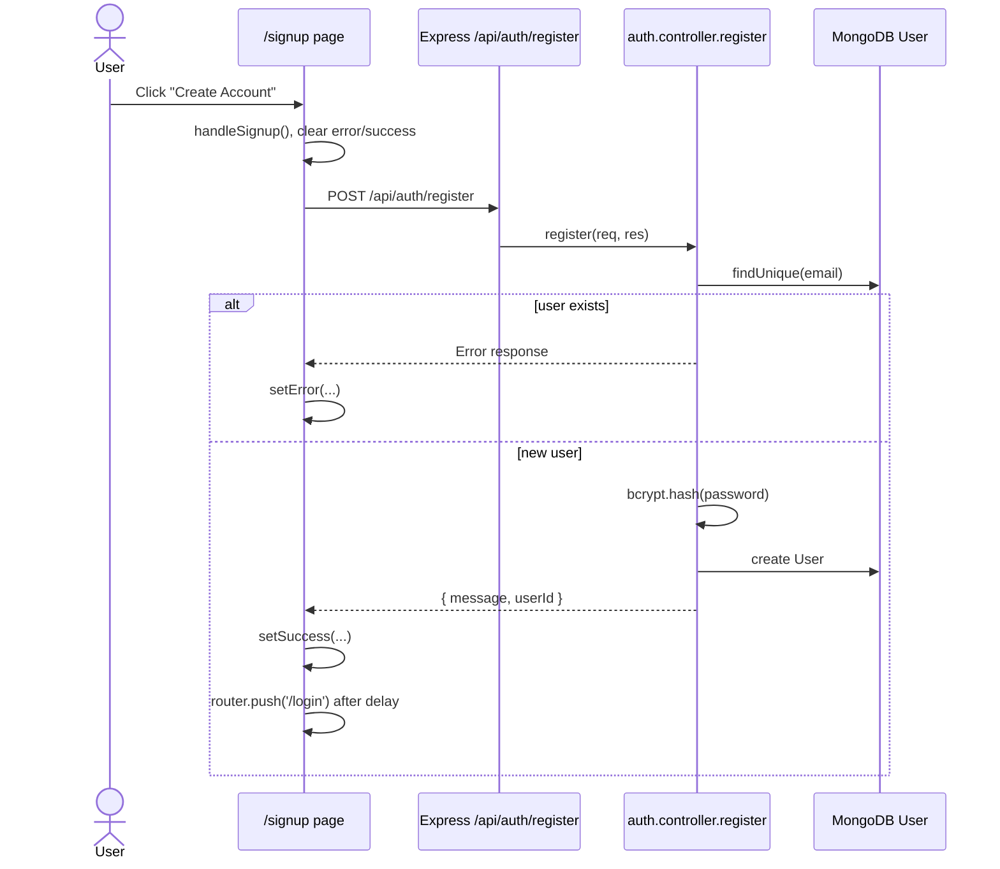

### Login Flow

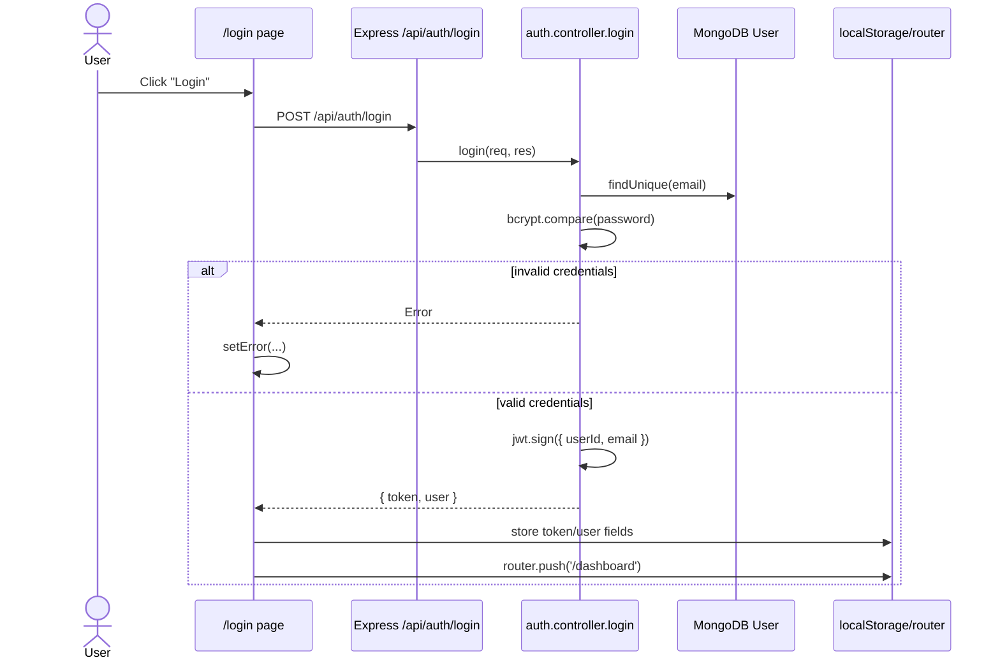

### Dashboard Initial Load

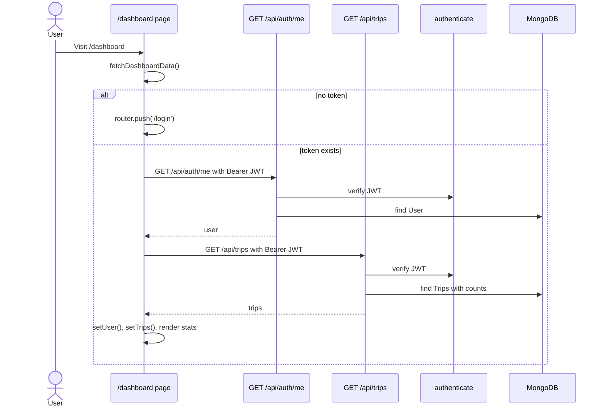

### Create Trip and Run Agents

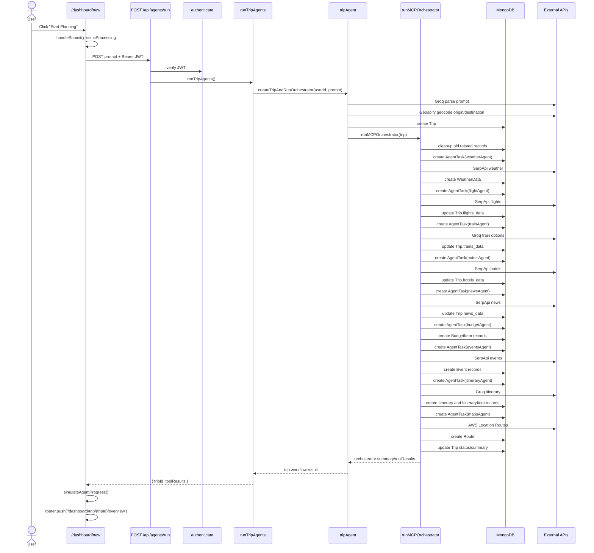

### Trip Overview to Module Page

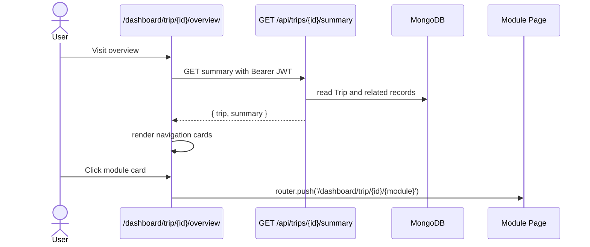

### Generic Module Data Load

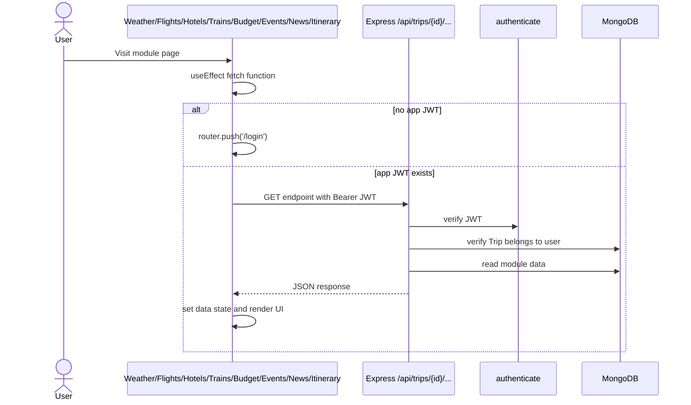

### Routes On-Demand Calculation

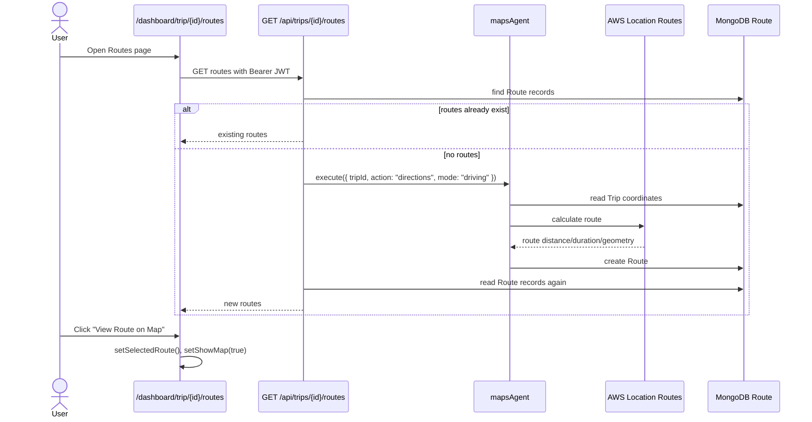

### Google Calendar Sync

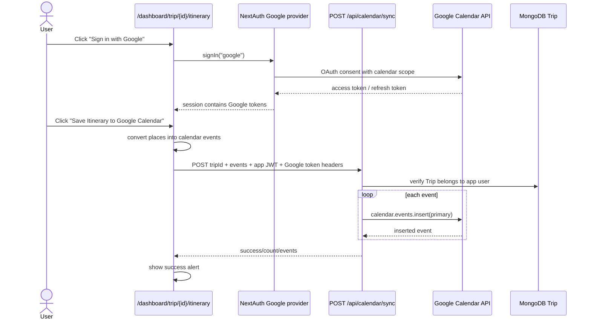

### PDF Download

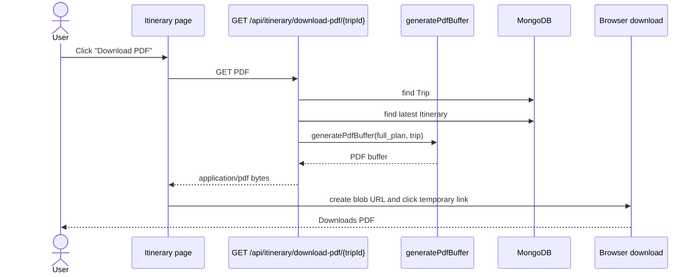

### Chatbot Flow

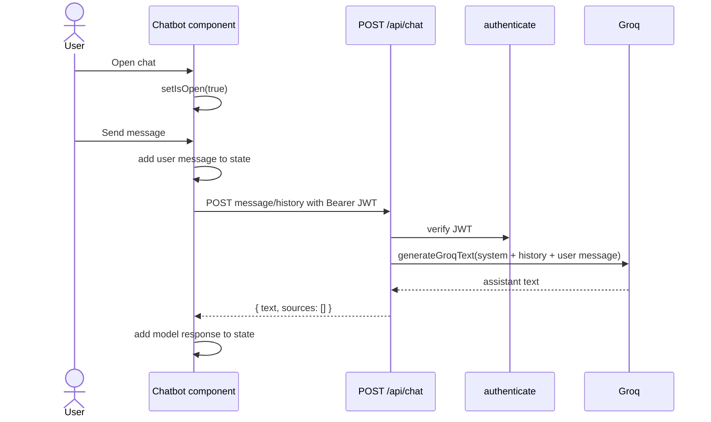

### Delete Trip Backend Flow

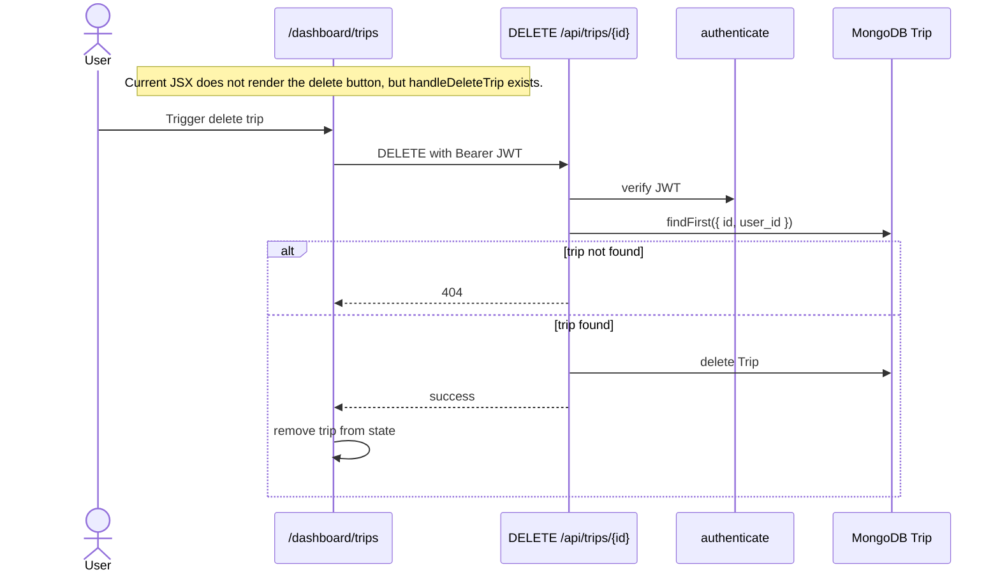

### Cron Recommendation Flow

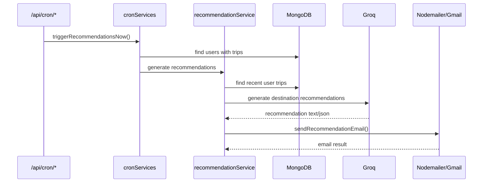

## Current Implementation Notes

- Trip creation is centered on `POST /api/agents/run`; `POST /api/trips/trips/start` is a legacy/placeholder acknowledgement route.
- `/dashboard/trips` renders `New Trip` and `Plan Your First Trip` buttons without navigation handlers.
- `/dashboard/trips` defines `handleDeleteTrip`, but the current rendered card action area is empty, so deletion is not reachable from the visible UI unless a button is added.
- The itinerary PDF route receives an Authorization header from the frontend but does not currently enforce `authenticate`.
- The Express calendar controller attempts to update `Trip.last_calendar_sync`, but that field is not present in `backend/prisma/schema.prisma`.
- The frontend file path uses `calender` in one Next API route folder, while Express mounts `/api/calendar` from `calender.routes.js`.
- `emailRoutes.js` is present but not mounted in `backend/app.js`.
